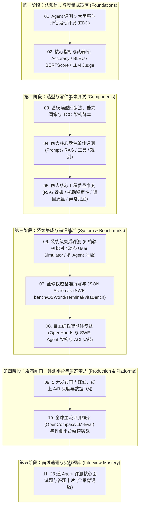

<div align="center">

# 🤖 Awesome Agent Eval (工业级 AI Agent 评测全景体系)

**The Definitive Guide, Methodology & Engineering Toolkit for AI Agent Evaluation**

[](https://opensource.org/licenses/MIT)
[](https://www.python.org/)
[](https://github.com/)
[](https://awesome.re)

[English](./README_EN.md) | [简体中文](./README.md) | [📚 体系化指南](./docs/) | [💻 实战代码](./evals/) | [📊 黄金数据集](./datasets/)

</div>

---

## 📖 项目简介 (Introduction)

随着大语言模型从单轮问答演进为具备“自主规划、工具调用、多轮交互、多智能体协作”的 **AI Agent**，传统的确定性软件测试与简单的问答评测已经完全失效。

**Awesome Agent Eval** 旨在构建一个**工业级、端到端、零基础到精通的 AI Agent 评测体系与实操框架**。

本项目不仅覆盖**核心度量指标（Accuracy、BLEU、BERTScore、NDCG）** 与 **主流评测框架（OpenCompass、LM-Eval-Harness、DeepEval、Ragas）**，更提供 **企业级评测平台架构开发方案、开箱即用的自动化测试脚本、标准数据结构（JSON Schemas）与前沿基准深度剖析**。

---

## 🧭 5 阶渐进式学习路线图 (Progressive Learning Roadmap)



---

## 📊 NLP 与 LLM 核心度量指标全景速查 (Evaluation Metrics)

| 指标名称 | 计算原理与数学特性 | 适用评测场景 | 官方开源库 / 对应 GitHub |
| :--- | :--- | :--- | :--- |
| **Accuracy (准确率)** | 预测正确的样本比例 ($\frac{TP+TN}{Total}$) | 单选/多选题 (MMLU)、分类 | [`scikit-learn`](https://github.com/scikit-learn/scikit-learn) / [`huggingface/evaluate`](https://github.com/huggingface/evaluate) |
| **Exact Match (EM)** | 100% 严格一致（可配合标点/空格归一化） | 工具函数名、槽位抽取、状态码 | [`huggingface/evaluate`](https://github.com/huggingface/evaluate) |
| **BLEU (1~4)** | Modified n-gram 匹配精确率 + 简短惩罚 (BP) | 机器翻译、代码生成 (HumanEval) | [`nltk`](https://github.com/nltk/nltk) / [`sacrebleu`](https://github.com/mjpost/sacrebleu) |
| **ROUGE (1/2/L)** | 基于最长公共子序列（LCS）的召回率导向度量 | 文本摘要、文档提炼、新闻总结 | [`google-research/rouge`](https://github.com/google-research/google-research) |
| **BERTScore** | 预训练模型 Contextual Embedding 最大余弦相似度 | 开放式问答、释义匹配 (抗同义词) | [`Tiiiger/bert_score`](https://github.com/Tiiiger/bert_score) *(ICLR 2020)* |
| **NDCG@k / MRR** | 归一化折损累计增益与平均倒数排名 | RAG 知识检索切片排序质量评估 | [`ranx`](https://github.com/AmenDa/ranx) / [`scikit-learn`](https://github.com/scikit-learn/scikit-learn) |

---

## 🛠️ 全球主流评测平台与框架生态雷达 (Ecosystem Radar)

| 领域分类 | 核心平台 / 权威基准 | 主导机构 / 仓库 | 核心评测场景与特长 |
| :--- | :--- | :--- | :--- |
| **主流评测平台与框架** | **OpenCompass (司南)** | [open-compass/opencompass](https://github.com/open-compass/opencompass) (上海人工智能实验室) | **国内最权威的全栈一站式大模型与 Agent 评测平台**，支持分布式调度与多模态 Hub |
| | **LM-Evaluation-Harness** | [EleutherAI/lm-evaluation-harness](https://github.com/EleutherAI/lm-evaluation-harness) | 全球通用标准，Hugging Face Open LLM Leaderboard 官方底层评测引擎 |
| | **DeepEval** | [confident-ai/deepeval](https://github.com/confident-ai/deepeval) | 生产级 Agent 单元测试、G-Eval 自定义量规、CI/CD 自动化流水线集成 |
| | **HELM** | [stanford-crfm/helm](https://github.com/stanford-crfm/helm) (斯坦福大学) | 覆盖准确率、鲁棒性、公平性、偏见与毒性的全景综合评估体系 |
| | **Ragas** | [explodinggradients/ragas](https://github.com/explodinggradients/ragas) | 专注 RAG 检索质量、生成忠实度与多 Agent 通信交互评估 |
| | **Promptfoo** | [promptfoo/promptfoo](https://github.com/promptfoo/promptfoo) | 高性能 CLI 工具，主打 Prompt 变体对比与红队安全渗透自动化测试 |
| **代码与真实环境基准** | **SWE-bench** | [princeton-nlp/SWE-bench](https://github.com/princeton-nlp/SWE-bench) (普林斯顿/OpenAI) | 真实 GitHub Issue 代码修复（以 Docker 沙箱中 Unit Test 翻转为黄金标准） |
| | **OpenHands** | [All-Hands-AI/OpenHands](https://github.com/All-Hands-AI/OpenHands) | 顶尖自主编程 Agent 框架（EventStream 事件驱动 + CodeAct 模式） |
| | **SWE-Agent** | [princeton-nlp/SWE-agent](https://github.com/princeton-nlp/SWE-agent) (普林斯顿大学) | 首个开创 ACI（智能体-计算机接口）的分页查看与行级精准编辑开源智能体 |
| | **OSWorld** | [xlang-ai/OSWorld](https://github.com/xlang-ai/OSWorld) (港大/普林斯顿) | 真实 Ubuntu 操作系统多模态 GUI + CLI 跨应用（Office/Chrome/Terminal）操作基准 |
| | **Terminal-Bench** | [princeton-nlp/intercode](https://github.com/princeton-nlp/intercode) (普林斯顿/伯克利) | Linux 命令行终端 Bash 自主运维、网络排错与基于错误输出的自我纠错评测 |
| **业务与生活服务基准** | **VitaBench** | [meituan-longcat](https://github.com/meituan-longcat) (美团) | 外卖/到店/出行复杂生活服务三维 POMDP 建模、$\text{Pass}^4$ 严苛抗抖动压测 |
| | **TAU-bench** | [sierra-research/tau-bench](https://github.com/sierra-research/tau-bench) (Stanford/Sierra) | 智能客服环境状态验证（真实数据库事务回滚与防越权检查） |
| | **GAIA** | [gaia-benchmark](https://huggingface.co/spaces/gaia-benchmark/leaderboard) (Meta/HF) | 通用个人助手长链路多模态、多步骤文件/代码综合处理基准（反向图灵测试） |
| | **BFCL** | [Gorilla-LLM/BFCL](https://gorilla.cs.berkeley.edu/leaderboard.html) (UC 伯克利) | 原生 Tool Calling / Function Calling 权威排行榜与多语言调用评测 |

---

## 🐱 前沿聚焦：美团龙猫 (Meituan LongCat) 系列研究

| 研究成果 | 类型 | 核心创新点 / 评测意义 | 链接 |
| :--- | :---: | :--- | :--- |
| **VitaBench** | 评测基准 | 生活服务三维 POMDP 复杂度建模、66 工具依赖图、$\text{Pass}^4$ 严苛压测 | [详细解析](./docs/07-benchmark-schemas-and-cases.md#四-美团-vitabench生活服务复杂交互评测基准) |
| **LongCat-Next** | 顶会论文 | *Lexicalizing Modalities as Discrete Tokens*：原生统一离散多模态自回归架构 | [Paper (arXiv:2603.27538)](https://arxiv.org/pdf/2603.27538) · [GitHub Repo](https://github.com/meituan-longcat/LongCat-Next) |
| **LongCat-Flash** | 技术报告 | 高并发实时业务极致低时延推理、MoE 稀疏优化与长上下文 KV 压缩 | [Paper (arXiv:2509.01322)](https://arxiv.org/abs/2509.01322) |

---

## 📚 体系化深度指南目录 (Table of Contents)

| 章节 | 核心主题 | 关键要点 |
| :--- | :--- | :--- |
| [**01. 困境与 EDD**](./docs/01-dilemmas-and-edd.md) | Agent 评测 5 大困境与评估驱动开发 | 解决非确定性、过程不可见、数据污染与裁判偏见 |
| [**02. 指标与通用武器库**](./docs/02-general-weapons.md) | Accuracy/BLEU/BERTScore/Swap 比较 | 确定性代码度量、神经语义度量、双盲消偏与 Judge 量规 |
| [**03. 基模选型与 TCO**](./docs/03-model-selection.md) | 选型四步法与 TCO 架构降本 | 场景反推能力画像、旗舰与轻量模型分流架构 |
| [**04. 核心零件单体评测**](./docs/04-component-eval.md) | Prompt / RAG / 工具 / 规划单体验证 | RAG 忠实度、Tool Calling 防幻觉反例、规划反思错误 |
| [**05. 四大工程质量维度**](./docs/05-core-quality-dimensions.md) | RAG 效果、提示词鲁棒性、返回质量与异常兜底 | 扰动测试、JSON 结构合规、API 500 优雅降级与熔断防护 |
| [**06. 系统级集成评测**](./docs/06-system-integration.md) | 轨迹比对、多轮对抗与团队消融 | 5 档轨迹严格度、动态 User Simulator、多 Agent 消融实验 |
| [**07. 权威基准与数据结构**](./docs/07-benchmark-schemas-and-cases.md) | 权威基准深度拆解与 JSON Schemas | SWE-bench、OSWorld、Terminal-Bench、美团 LongCat、TAU-bench |
| [**08. 自主编程 Agent 专题**](./docs/08-autonomous-coding-agents.md) | OpenHands 与 SWE-Agent 架构深度拆解 | ACI 智能体-计算机接口设计、EventStream 与 SWE-bench 实战 |
| [**09. 发布闸门与运维监控**](./docs/09-release-and-ops.md) | 5 大发布闸门红线与线上可观测性 | 质量/时延/安全红线、灰度放量、数据飞轮回归闭环 |
| [**10. 评测平台与生态雷达**](./docs/10-awesome-tools-and-frameworks.md) | OpenCompass、LM-Eval 与评测系统架构 | 工业级评测平台 5 层架构设计方案与分布式算子调度 |
| [**11. 高频面试题库卡片**](./docs/11-interview-cards.md) | 23 道 Agent 评测核心面试题与答题卡片 | 涵盖概念、方法、指标、工程落地全景解析 |

---

## ⚡ 极速上手：运行自动化评测代码 (Quick Start)

```bash
# 1. 运行工具调用精准度与防幻觉测试
python evals/tool_eval_demo.py

# 2. 运行 RAG 检索段 Context Precision 与生成段 Faithfulness 测试
python evals/rag_eval_demo.py

# 3. 运行多轮动态 User Simulator 交互测试
python evals/user_simulator_demo.py

# 4. 运行消除首位偏差的双盲裁判测试 (Position-Swap Judge)
python evals/swap_judge_demo.py

# 5. 运行提示词扰动鲁棒性、JSON Schema 校验与 API 500 异常兜底测试
python evals/robustness_and_fallback_demo.py
```

---

## 📊 评测数据集模板 (Golden Benchmark Datasets)

本项目在 [`datasets/`](./datasets/) 目录下提供了工业级评测数据集模板：
* [`tool_test_cases.json`](./datasets/tool_test_cases.json)：包含标准工具调用与“不该调工具”的防幻觉反例；
* [`multi_turn_goals.json`](./datasets/multi_turn_goals.json)：包含环境配置、隐藏目标卡与多轮 Rubric 判定标准；
* [`rag_golden_set.json`](./datasets/rag_golden_set.json)：包含知识切片、标准回答与忠实度基准。

---

## 🤝 参与贡献 (Contributing)

欢迎提交 Issue 和 Pull Request！
- 🌟 分享工业界前沿的 Agent 评测论文与 Benchmark；
- 🛠️ 贡献新的 Metric 评测算法与实战代码；
- 📝 优化中英文文档与面试题库。

---

## 📄 开源许可证 (License)

本项目采用 [MIT License](./LICENSE) 协议开源。欢迎自由引用与二次开发，请保留原作者出处！
