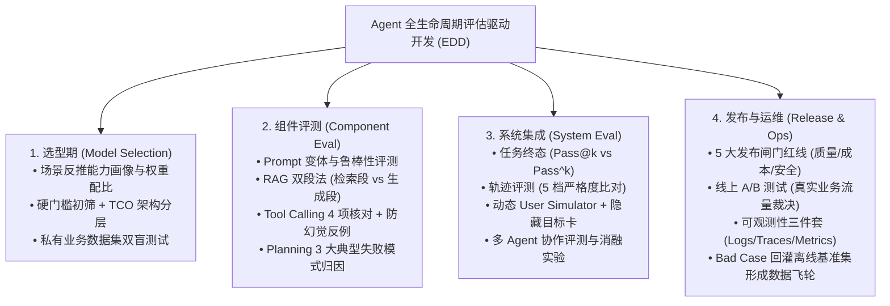

<div align="center">

# 🤖 Awesome Agent Eval (工业级 AI Agent 评测全景体系)

**The Definitive Guide, Methodology & Engineering Toolkit for AI Agent Evaluation**

[](https://opensource.org/licenses/MIT)
[](https://www.python.org/)
[](https://github.com/)
[](https://awesome.re)

[English](./README_EN.md) | [简体中文](./README.md) | [📚 体系化指南](./docs/) | [💻 实战代码](./evals/) | [📊 黄金数据集](./datasets/)

</div>

---

## 📖 项目简介 (Introduction)

随着大模型从单轮对话演进为具备“自主规划、工具调用、多轮交互与多智能体协作”的 **AI Agent**，传统的软件测试与简单的问答评测已经完全失效。

**Awesome Agent Eval** 旨在构建一个**工业级、端到端、贯穿 Agent 全生命周期（选型 ➔ 零件 ➔ 轨迹 ➔ 发布 ➔ 监控）的评测体系与实战框架**，解决 Agent 落地中“评不准、看不清、难复现、无闭环”的核心痛点。

---

## 🧭 Agent 评测全生命周期架构图 (Evaluation Landscape)



---

## 📚 体系化深度指南 (Comprehensive Guides)

| 章节 | 核心主题 | 关键要点 |
| :--- | :--- | :--- |
| [**01. 困境与 EDD**](./docs/01-dilemmas-and-edd.md) | Agent 评测 5 大困境与评估驱动开发 | 解决非确定性、过程不可见、数据污染与裁判偏见 |
| [**02. 通用武器库**](./docs/02-general-weapons.md) | 三大通用评测方法与度量衡 | 精确匹配 / 比较评估 (Position Swap) / LLM-as-a-Judge |
| [**03. 基模选型**](./docs/03-model-selection.md) | 选型四步法与 TCO 架构降本 | 场景反推能力画像、旗舰与轻量模型分流架构 |
| [**04. 核心零件评测**](./docs/04-component-eval.md) | Prompt / RAG / 工具 / 规划单体验证 | RAG 忠实度、Tool Calling 防幻觉反例、规划反思错误 |
| [**05. 系统级集成**](./docs/05-system-integration.md) | 轨迹比对、多轮对抗与团队消融 | 5 档轨迹严格度、动态 User Simulator、多 Agent 消融实验 |
| [**06. 发布与运维**](./docs/06-release-and-ops.md) | 5 大发布闸门红线与线上可观测性 | 质量/时延/安全红线、灰度放量、数据飞轮回归闭环 |
| [**07. 前沿案例**](./docs/07-case-studies.md) | 工业界评测落地最佳实践 | 美团 VitaBench ($\text{Pass}^4$)、BFCL、SWE-bench |
| [**08. 高频面试题**](./docs/08-interview-cards.md) | 23 道 Agent 评测核心面试题与答题卡片 | 涵盖概念、方法、指标、工程落地全景解析 |

---

## ⚡ 极速上手：运行自动化评测代码 (Quick Start)

### 1. 克隆代码仓库并安装依赖
```bash
git clone https://github.com/你的用户名/awesome-agent-eval.git
cd awesome-agent-eval
pip install -r requirements.txt
```

### 2. 运行开箱即用的评测用例 (基于 Pytest & DeepEval)

#### 运行工具调用精准度与防幻觉测试：
```bash
pytest evals/tool_eval_demo.py -v -s
```

#### 运行 RAG 检索与生成双段测试：
```bash
pytest evals/rag_eval_demo.py -v -s
```

#### 运行多轮动态 User Simulator 交互测试：
```bash
python evals/user_simulator_demo.py
```

#### 运行消除首位偏差的双盲裁判测试 (Position-Swap Judge)：
```bash
python evals/swap_judge_demo.py
```

---

## 📊 评测数据集模板 (Golden Benchmark Datasets)

本项目在 [`datasets/`](./datasets/) 目录下提供了工业级评测数据集模板：
* [`tool_test_cases.json`](./datasets/tool_test_cases.json)：包含标准工具调用与“不该调工具”的防幻觉反例；
* [`multi_turn_goals.json`](./datasets/multi_turn_goals.json)：包含环境配置、隐藏目标卡与多轮 Rubric 判定标准；
* [`rag_golden_set.json`](./datasets/rag_golden_set.json)：包含知识切片、标准回答与忠实度基准。

---

## 🤝 参与贡献 (Contributing)

欢迎提交 Issue 和 Pull Request！
- 🌟 分享工业界前沿的 Agent 评测论文与 Benchmark；
- 🛠️ 贡献新的 Metric 评测算法与实战代码；
- 📝 优化中英文文档与面试题库。

---

## 📄 开源许可证 (License)

本项目采用 [MIT License](./LICENSE) 协议开源。欢迎自由引用与二次开发，请保留原作者出处！
