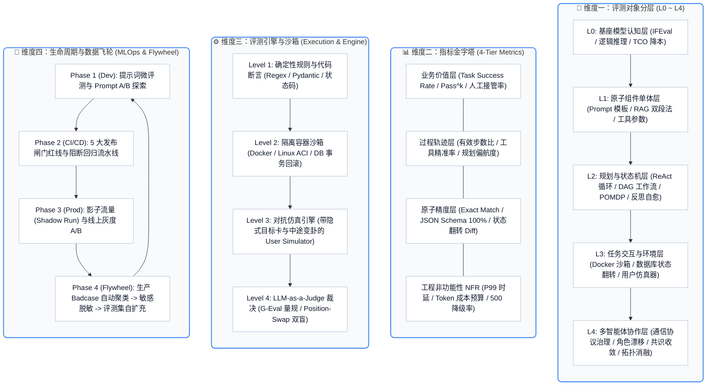

<div align="center">

# 🤖 Awesome Agent Eval (工业级 AI Agent 评测全景体系)

**The Definitive Methodology, Architecture & Engineering Toolkit for AI Agent Evaluation**

[](https://opensource.org/licenses/MIT)
[](https://www.python.org/)
[](https://github.com/)
[](https://awesome.re)

[English](./README_EN.md) | [简体中文](./README.md) | [📚 体系白皮书](./docs/01-framework-and-edd.md) | [🚀 落地 SOP](./docs/02-enterprise-adoption-sop.md) | [💻 实战代码](./evals/) | [📊 黄金数据集](./datasets/)

</div>

---

## 📖 项目定位与体系蓝图 (Introduction & Architecture)

随着大语言模型从单轮文本生成演进为具备“自主规划、工具调用、长期记忆、环境交互与多智能体协作”的 **AI Agent**，传统的确定性软件测试（`assert == expected`）与简单的问答打分已彻底失效。

**Awesome Agent Eval** 确立了工业界领先的 **4 维正交评测全景架构** 与 **评估驱动开发（EDD）工程范式**，涵盖：
* **维度一：评测对象分层 (What: L0 ~ L4)**：基模认知 ➔ 原子组件 ➔ 规划状态机 ➔ 端到端沙箱 ➔ 多智能体协作；
* **维度二：指标金字塔 (How: 4-Tier Metrics)**：确定性断言 ➔ 过程轨迹质量 ➔ 业务价值 ROI ➔ 横向工程质量 (NFR)；
* **维度三：评测执行与裁判引擎 (Engine: 4 Levels)**：代码断言 ➔ Docker/ACI 隔离沙箱 ➔ 动态对抗仿真 ➔ 双盲消偏裁判；
* **维度四：生命周期与数据飞轮 (Lifecycle: Dev to Flywheel)**：开发微评测 ➔ 5 大发布闸门 ➔ 影子流量 ➔ Badcase 自进化闭环。



---

## 📚 12 阶体系化白皮书导航 (Table of Contents)

> 💡 **学习与建设指引**：企业落地建议首先阅读 **01 体系总览** 与 **02 落地演进 SOP**，明确各阶段重点；再按 **L0~L4 分层** 逐步构筑评测能力：

| 章节与链接 | 核心模块归属 | 核心攻坚要点与实战指引 |
| :--- | :--- | :--- |
| [**01. 体系总览与 EDD**](./docs/01-framework-and-edd.md) | **方法论总纲** | 4 维正交全景架构、指标金字塔、Agent 评测 5 大困境与评估驱动开发（EDD）哲学 |
| [**02. 企业落地实战 SOP**](./docs/02-enterprise-adoption-sop.md) | **工程落地** | Day 1~7（冷启动）➔ Day 8~30（CI/CD门禁）➔ Day 31~60（仿真沙箱）➔ Day 61~90（生产飞轮）与 RACI 矩阵 |
| [**03. L0 基座模型评测**](./docs/03-l0-foundation-model-eval.md) | **对象分层 L0** | 基模四步选型法、IFEval 指令遵循、长文本针中寻草与旗舰/轻量模型分流 TCO 降本架构 |
| [**04. L1 原子组件单体**](./docs/04-l1-atomic-components-eval.md) | **对象分层 L1** | Prompt 模板微评测、RAG 检索/生成双段量化（NDCG/Faithfulness）、工具调用 5 项核对与反例防幻觉 |
| [**05. L2 规划与状态机**](./docs/05-l2-planning-and-state-eval.md) | **对象分层 L2** | ReAct 循环稳定性、DAG 状态机跃迁、POMDP 状态建模、死循环拦截与反思自愈评估 |
| [**06. L3 任务交互与沙箱**](./docs/06-l3-end-to-end-system-eval.md) | **对象分层 L3** | 5 档轨迹比对量规、Docker 沙箱真实状态翻转（DB/FS State Diff）、动态 User Simulator 对抗博弈 |
| [**07. L4 多智能体协作**](./docs/07-l4-multi-agent-eval.md) | **对象分层 L4** | 通信协议开销、角色漂移（Role Drift）、协作共识收敛度、死锁拦截与拓扑消融分析 |
| [**08. 指标与裁判武器库**](./docs/08-metrics-and-judge-arsenal.md) | **度量衡与引擎** | 确定性断言、NLP 统计与语义度量（BERTScore）、G-Eval 量规编制与 Position-Swap 双盲消除首位偏见 |
| [**09. 工程非功能质量 NFR**](./docs/09-engineering-nfr-eval.md) | **横向工程属性** | 输入扰动鲁棒性（标点/错别字/语序）、JSON Schema 100% 校验、API 500/网络超时优雅降级与成本时延 |
| [**10. 权威基准与数据规范**](./docs/10-benchmark-schemas-and-cases.md) | **全球基准拆解** | SWE-bench（代码）、OSWorld（操作系统）、Terminal-Bench（运维）、VitaBench（生活服务）标准数据结构 |
| [**11. 自主编程与 GUI 专题**](./docs/11-autonomous-coding-and-gui.md) | **垂直形态前沿** | OpenHands（CodeAct 模式）与 SWE-Agent（ACI 接口）自主编程架构深度拆解与沙箱评测实战 |
| [**12. 生产闸门与中台闭环**](./docs/12-platform-gates-and-flywheel.md) | **生产发布与平台** | 5 大发布闸门红线、企业级评测中台 5 层标准架构、生产数据自进化飞轮与 25 个工业避坑 FAQ |

---

## 🛠️ 全球主流评测平台与框架生态雷达 (Ecosystem Radar)

| 领域分类 | 核心平台 / 权威基准 | 主导机构 / 仓库 | 核心评测场景与特长 |
| :--- | :--- | :--- | :--- |
| **主流评测平台与框架** | **OpenCompass (司南)** | [open-compass/opencompass](https://github.com/open-compass/opencompass) (上海人工智能实验室) | **国内最权威的全栈一站式大模型与 Agent 评测平台**，支持分布式调度与多模态 Hub |
| | **LM-Evaluation-Harness** | [EleutherAI/lm-evaluation-harness](https://github.com/EleutherAI/lm-evaluation-harness) | 全球通用标准，Hugging Face Open LLM Leaderboard 官方底层评测引擎 |
| | **DeepEval** | [confident-ai/deepeval](https://github.com/confident-ai/deepeval) | 生产级 Agent 单元测试、G-Eval 自定义量规、CI/CD 自动化流水线集成 |
| | **HELM** | [stanford-crfm/helm](https://github.com/stanford-crfm/helm) (斯坦福大学) | 覆盖准确率、鲁棒性、公平性、偏见与毒性的全景综合评估体系 |
| | **Ragas** | [explodinggradients/ragas](https://github.com/explodinggradients/ragas) | 专注 RAG 检索质量、生成忠实度与多 Agent 通信交互评估 |
| | **Promptfoo** | [promptfoo/promptfoo](https://github.com/promptfoo/promptfoo) | 高性能 CLI 工具，主打 Prompt 变体对比与红队安全渗透自动化测试 |
| **代码与真实环境基准** | **SWE-bench** | [princeton-nlp/SWE-bench](https://github.com/princeton-nlp/SWE-bench) (普林斯顿/OpenAI) | 真实 GitHub Issue 代码修复（以 Docker 沙箱中 Unit Test 翻转为黄金标准） |
| | **OpenHands** | [All-Hands-AI/OpenHands](https://github.com/All-Hands-AI/OpenHands) | 顶尖自主编程 Agent 框架（EventStream 事件驱动 + CodeAct 模式） |
| | **SWE-Agent** | [princeton-nlp/SWE-agent](https://github.com/princeton-nlp/SWE-agent) (普林斯顿大学) | 首个开创 ACI（智能体-计算机接口）的分页查看与行级精准编辑开源智能体 |
| | **OSWorld** | [xlang-ai/OSWorld](https://github.com/xlang-ai/OSWorld) (港大/普林斯顿) | 真实 Ubuntu 操作系统多模态 GUI + CLI 跨应用（Office/Chrome/Terminal）操作基准 |
| | **Terminal-Bench** | [princeton-nlp/intercode](https://github.com/princeton-nlp/intercode) (普林斯顿/伯克利) | Linux 命令行终端 Bash 自主运维、网络排错与基于错误输出的自我纠错评测 |
| **业务与生活服务基准** | **VitaBench** | [meituan-longcat](https://github.com/meituan-longcat) (美团) | 外卖/到店/出行复杂生活服务三维 POMDP 建模、`Pass^4` 严苛抗抖动压测 |
| | **TAU-bench** | [sierra-research/tau-bench](https://github.com/sierra-research/tau-bench) (Stanford/Sierra) | 智能客服环境状态验证（真实数据库事务回滚与防越权检查） |
| | **GAIA** | [gaia-benchmark](https://huggingface.co/spaces/gaia-benchmark/leaderboard) (Meta/HF) | 通用个人助手长链路多模态、多步骤文件/代码综合处理基准（反向图灵测试） |
| | **BFCL** | [Gorilla-LLM/BFCL](https://gorilla.cs.berkeley.edu/leaderboard.html) (UC 伯克利) | 原生 Tool Calling / Function Calling 权威排行榜与多语言调用评测 |

---

## 🐱 前沿聚焦：美团龙猫 (Meituan LongCat) 系列研究

| 研究成果 | 类型 | 核心创新点 / 评测意义 | 链接 |
| :--- | :---: | :--- | :--- |
| **VitaBench** | 评测基准 | 生活服务三维 POMDP 复杂度建模、66 工具依赖图、`Pass^4` 严苛压测 | [详细解析](./docs/10-benchmark-schemas-and-cases.md#五-案例专题四美团龙猫-meituan-longcat-全景前沿体系) |
| **LongCat-Next** | 顶会论文 | *Lexicalizing Modalities as Discrete Tokens*：原生统一离散多模态自回归架构 | [Paper (arXiv:2603.27538)](https://arxiv.org/pdf/2603.27538) · [GitHub Repo](https://github.com/meituan-longcat/LongCat-Next) |
| **LongCat-Flash** | 技术报告 | 高并发实时业务极致低时延推理、MoE 稀疏优化与长上下文 KV 压缩 | [Paper (arXiv:2509.01322)](https://arxiv.org/abs/2509.01322) |

---

## ⚡ 极速上手：运行自动化评测代码 (Quick Start)

```bash
# 1. 运行工具调用精准度与防幻觉测试
python evals/tool_eval_demo.py

# 2. 运行 RAG 检索段 Context Precision 与生成段 Faithfulness 测试
python evals/rag_eval_demo.py

# 3. 运行多轮动态 User Simulator 交互测试
python evals/user_simulator_demo.py

# 4. 运行消除首位偏差的双盲裁判测试 (Position-Swap Judge)
python evals/swap_judge_demo.py

# 5. 运行提示词扰动鲁棒性、JSON Schema 校验与 API 500 异常兜底测试
python evals/robustness_and_fallback_demo.py
```

---

## 📊 评测数据集模板 (Golden Benchmark Datasets)

本项目在 [`datasets/`](./datasets/) 目录下提供了工业级评测数据集模板：
* [`tool_test_cases.json`](./datasets/tool_test_cases.json)：包含标准工具调用与“不该调工具”的防幻觉反例；
* [`multi_turn_goals.json`](./datasets/multi_turn_goals.json)：包含环境配置、隐藏目标卡与多轮 Rubric 判定标准；
* [`rag_golden_set.json`](./datasets/rag_golden_set.json)：包含知识切片、标准回答与忠实度基准。

---

## 🤝 参与贡献 (Contributing)

欢迎提交 Issue 和 Pull Request！
- 🌟 分享工业界前沿的 Agent 评测论文与 Benchmark；
- 🛠️ 贡献新的 Metric 评测算法与实战代码；
- 📝 优化中英文文档与前沿案例分析。

---

## 📄 开源许可证 (License)

本项目采用 [MIT License](./LICENSE) 协议开源。欢迎自由引用与二次开发，请保留原作者出处！
