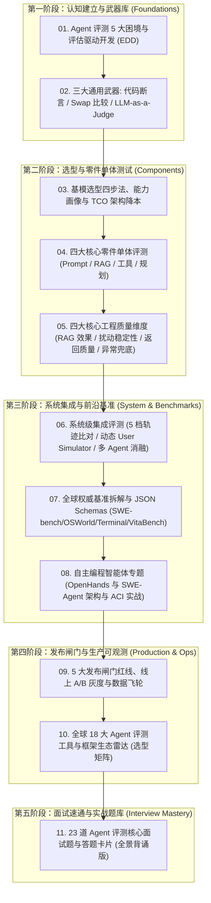

<div align="center">

# 🤖 Awesome Agent Eval (工业级 AI Agent 评测全景体系)

**The Definitive Guide, Methodology & Engineering Toolkit for AI Agent Evaluation**

[](https://opensource.org/licenses/MIT)
[](https://www.python.org/)
[](https://github.com/)
[](https://awesome.re)

[English](./README_EN.md) | [简体中文](./README.md) | [📚 体系化指南](./docs/) | [💻 实战代码](./evals/) | [📊 黄金数据集](./datasets/)

</div>

---

## 📖 项目简介 (Introduction)

随着大语言模型从单轮问答演进为具备“自主规划、工具调用、多轮交互、多智能体协作”的 **AI Agent**，传统的确定性软件测试与简单的问答评测已经完全失效。

**Awesome Agent Eval** 旨在构建一个**工业级、端到端、零基础到精通的 AI Agent 评测体系与实操框架**。

本项目不仅覆盖方法论与评测设计，更提供**开箱即用的自动化测试代码、工业级数据结构（JSON Schemas）与前沿基准深度剖析**，帮助测试开发工程师、算法工程师与架构师系统化掌握 Agent 质量保障体系。

---

## 🧭 5 阶渐进式学习路线图 (Progressive Learning Roadmap)



---

## 📚 体系化深度指南目录 (Table of Contents)

### 📌 第一篇章：认知与方法论底座
* [**01. 困境与 EDD**](./docs/01-dilemmas-and-edd.md)：从非确定性、失败模式识别到评估驱动开发（EDD）的核心思想；
* [**02. 通用武器库**](./docs/02-general-weapons.md)：精确匹配 (EM/F1)、比较评估 (Position-Swap 双盲) 与 LLM-as-a-Judge (Rubric 消除偏见)。

### 📌 第二篇章：选型、单体与工程质量
* [**03. 基模选型与 TCO**](./docs/03-model-selection.md)：场景反推能力画像、硬门槛初筛与旗舰/轻量模型分流降本；
* [**04. 核心零件单体评测**](./docs/04-component-eval.md)：Prompt 变体、RAG 双段法、Tool Calling 4 项核对与规划反思错误；
* [**05. 四大工程质量维度**](./docs/05-core-quality-dimensions.md)：RAG 检索效果指标、提示词扰动鲁棒性、JSON Schema 结构合规与 API 500 优雅降级。

### 📌 第三篇章：系统集成、权威基准与自主编程
* [**06. 系统级集成评测**](./docs/06-system-integration.md)：5 档轨迹严格度比对、动态 User Simulator（中途改口博弈）与多 Agent 协作消融实验；
* [**07. 权威基准与数据结构**](./docs/07-benchmark-schemas-and-cases.md)：SWE-bench、OSWorld、Terminal-Bench、美团 VitaBench、TAU-bench 标准 JSON Schema 与判分规则；
* [**08. 自主编程 Agent 专题**](./docs/08-autonomous-coding-agents.md)：OpenHands (EventStream/CodeAct) 与 SWE-Agent (ACI 接口) 架构深度拆解。

### 📌 第四篇章：生产发布、工具雷达与面试通关
* [**09. 发布闸门与运维监控**](./docs/09-release-and-ops.md)：5 大发布闸门红线、线上 A/B 测试、可观测性三件套与数据飞轮；
* [**10. 全球生态雷达矩阵**](./docs/10-awesome-tools-and-frameworks.md)：全球 18 大核心评测工具（DeepEval, Ragas, Promptfoo, Inspect AI）对比与测试团队选型路径；
* [**11. 高频面试题库卡片**](./docs/11-interview-cards.md)：精选 23 道核心面试大题与高分标准背诵卡片。

---

## 🛠️ 全球前沿 Agent 评测工具与框架生态雷达 (Ecosystem Radar)

| 领域分类 | 核心工具 / 权威基准 | 主导机构 / 仓库 | 核心评测场景与特长 |
| :--- | :--- | :--- | :--- |
| **自主编程 Agent 与代码基准** | **SWE-bench** | [princeton-nlp/SWE-bench](https://github.com/princeton-nlp/SWE-bench) (普林斯顿/OpenAI) | 真实 GitHub Issue 代码修复（以 Docker 沙箱中 Unit Test 翻转为黄金标准） |
| | **OpenHands** | [All-Hands-AI/OpenHands](https://github.com/All-Hands-AI/OpenHands) | 顶尖自主编程 Agent 框架（EventStream 事件驱动 + CodeAct 代码执行模式） |
| | **SWE-Agent** | [princeton-nlp/SWE-agent](https://github.com/princeton-nlp/SWE-agent) (普林斯顿大学) | 首个开创 ACI（智能体-计算机接口）的分页查看与行级精准编辑开源智能体 |
| **系统与终端交互基准** | **OSWorld** | [xlang-ai/OSWorld](https://github.com/xlang-ai/OSWorld) (港大/普林斯顿) | 真实 Ubuntu 操作系统多模态 GUI + CLI 跨应用（Office/Chrome/Terminal）操作基准 |
| | **Terminal-Bench** | [princeton-nlp/intercode](https://github.com/princeton-nlp/intercode) (普林斯顿/伯克利) | Linux 命令行终端 Bash 自主运维、网络排错与基于错误输出的自我纠错评测 |
| **复杂业务场景基准** | **VitaBench** | [meituan-longcat](https://github.com/meituan-longcat) (美团) | 外卖/到店/出行复杂生活服务三维 POMDP 建模、$\text{Pass}^4$ 严苛抗抖动压测 |
| | **TAU-bench** | [sierra-research/tau-bench](https://github.com/sierra-research/tau-bench) (Stanford/Sierra) | 智能客服环境状态验证（真实数据库事务回滚与防越权检查） |
| | **GAIA** | [gaia-benchmark](https://huggingface.co/spaces/gaia-benchmark/leaderboard) (Meta/HF) | 通用个人助手长链路多模态、多步骤文件/代码综合处理基准（反向图灵测试） |
| | **BFCL** | [Gorilla-LLM/BFCL](https://gorilla.cs.berkeley.edu/leaderboard.html) (UC 伯克利) | 原生 Tool Calling / Function Calling 权威排行榜与多语言调用评测 |
| **评测框架与断言库** | **DeepEval** | [confident-ai/deepeval](https://github.com/confident-ai/deepeval) | 生产级 Agent 单元测试、G-Eval 自定义量规、CI/CD 集成 (本仓库默认引擎) |
| | **Ragas** | [explodinggradients/ragas](https://github.com/explodinggradients/ragas) | 专注 RAG 检索质量、生成忠实度与多 Agent 通信交互评估 |
| | **Promptfoo** | [promptfoo/promptfoo](https://github.com/promptfoo/promptfoo) | 高性能 CLI 工具，主打 Prompt 变体对比与红队安全渗透自动化测试 |
| | **Inspect AI** | [UK-AI-Safety-Institute/inspect_ai](https://github.com/UK-AI-Safety-Institute/inspect_ai) | 英国人工智能安全研究所出品，专注模型长链路安全与能力评估 |
| | **DSPy** | [stanfordnlp/dspy](https://github.com/stanfordnlp/dspy) | 斯坦福大学出品，通过自动化 Metric 驱动 Prompt 自动编译与调优 |
| **可观测与 Tracing** | **AgentOps** | [AgentOps-AI/agentops](https://github.com/AgentOps-AI/agentops) | 专为 Agent 设计的调用链追踪、死循环检测与 Token 费用分析 |
| | **Phoenix** | [Arize-AI/phoenix](https://github.com/Arize-AI/phoenix) | 完全开源的 LLM/RAG 可观测性平台与 UMAP 语义漂移聚类分析 |

---

## 🐱 前沿聚焦：美团龙猫 (Meituan LongCat) 系列研究

| 研究成果 | 类型 | 核心创新点 / 评测意义 | 链接 |
| :--- | :---: | :--- | :--- |
| **VitaBench** | 评测基准 | 生活服务三维 POMDP 复杂度建模、66 工具依赖图、$\text{Pass}^4$ 严苛压测 | [详细解析](./docs/07-benchmark-schemas-and-cases.md#四-美团-vitabench生活服务复杂交互评测基准) |
| **LongCat-Next** | 顶会论文 | *Lexicalizing Modalities as Discrete Tokens*：原生统一离散多模态自回归架构 | [Paper (arXiv:2603.27538)](https://arxiv.org/pdf/2603.27538) · [GitHub Repo](https://github.com/meituan-longcat/LongCat-Next) |
| **LongCat-Flash** | 技术报告 | 高并发实时业务极致低时延推理、MoE 稀疏优化与长上下文 KV 压缩 | [Paper (arXiv:2509.01322)](https://arxiv.org/abs/2509.01322) |

---

## ⚡ 极速上手：运行自动化评测代码 (Quick Start)

### 1. 克隆代码仓库并安装依赖
```bash
git clone https://github.com/Anlon-27/awesome-agent-eval.git
cd awesome-agent-eval
pip install -r requirements.txt
```

### 2. 运行开箱即用的评测用例 (基于 Python & Pytest)

```bash
# 1. 运行工具调用精准度与防幻觉测试
python evals/tool_eval_demo.py

# 2. 运行 RAG 检索段 Context Precision 与生成段 Faithfulness 测试
python evals/rag_eval_demo.py

# 3. 运行多轮动态 User Simulator 交互测试
python evals/user_simulator_demo.py

# 4. 运行消除首位偏差的双盲裁判测试 (Position-Swap Judge)
python evals/swap_judge_demo.py

# 5. 运行提示词扰动鲁棒性、JSON Schema 校验与 API 500 异常兜底测试
python evals/robustness_and_fallback_demo.py
```

---

## 📊 评测数据集模板 (Golden Benchmark Datasets)

本项目在 [`datasets/`](./datasets/) 目录下提供了工业级评测数据集模板：
* [`tool_test_cases.json`](./datasets/tool_test_cases.json)：包含标准工具调用与“不该调工具”的防幻觉反例；
* [`multi_turn_goals.json`](./datasets/multi_turn_goals.json)：包含环境配置、隐藏目标卡与多轮 Rubric 判定标准；
* [`rag_golden_set.json`](./datasets/rag_golden_set.json)：包含知识切片、标准回答与忠实度基准。

---

## 🤝 参与贡献 (Contributing)

欢迎提交 Issue 和 Pull Request！
- 🌟 分享工业界前沿的 Agent 评测论文与 Benchmark；
- 🛠️ 贡献新的 Metric 评测算法与实战代码；
- 📝 优化中英文文档与面试题库。

---

## 📄 开源许可证 (License)

本项目采用 [MIT License](./LICENSE) 协议开源。欢迎自由引用与二次开发，请保留原作者出处！
