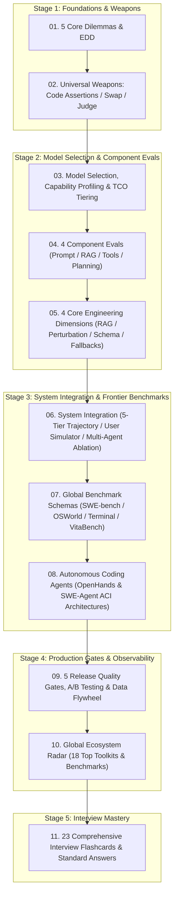

<div align="center">

# 🤖 Awesome Agent Eval

**The Definitive Guide, Methodology & Engineering Toolkit for AI Agent Evaluation**

[](https://opensource.org/licenses/MIT)
[](https://www.python.org/)
[](https://github.com/)
[](https://awesome.re)

[English](./README_EN.md) | [简体中文](./README.md) | [📚 Docs](./docs/) | [💻 Evals Code](./evals/) | [📊 Datasets](./datasets/)

</div>

---

## 📖 Introduction

As Large Language Models evolve from simple single-turn chatbots into autonomous **AI Agents** equipped with multi-step planning, tool calling, multi-turn interaction, and multi-agent coordination, traditional software assertions and basic Q&A evaluation metrics fall short.

**Awesome Agent Eval** provides an **industry-grade, end-to-end, zero-to-hero evaluation curriculum and engineering framework**.

This project provides not only methodologies and benchmark designs, but also **ready-to-run automation test scripts, standard JSON schemas, and deep dives into cutting-edge benchmarks**.

---

## 🧭 5-Stage Progressive Learning Roadmap



---

## 📚 Table of Contents

### 📌 Section 1: Foundations & Methodology
- [**01. 5 Core Dilemmas & EDD**](./docs/01-dilemmas-and-edd.md): Non-determinism, failure mode recognition, and Evaluation-Driven Development (EDD).
- [**02. Universal Weapons**](./docs/02-general-weapons.md): Exact Match, Position-Swap comparative evaluation, and LLM-as-a-Judge rubrics.

### 📌 Section 2: Selection, Components & Quality Dimensions
- [**03. Model Selection & TCO**](./docs/03-model-selection.md): Capability profiling and hierarchical model routing for cost reduction.
- [**04. Component Evaluation**](./docs/04-component-eval.md): Prompt variants, RAG 2-stage eval, tool calling 4-check, and planning reflection errors.
- [**05. 4 Core Engineering Dimensions**](./docs/05-core-quality-dimensions.md): RAG effectiveness, prompt perturbation robustness, JSON schema integrity, and API 500 fallbacks.

### 📌 Section 3: System Integration, Benchmarks & Coding Agents
- [**06. System Integration**](./docs/06-system-integration.md): 5-tier trajectory matching, dynamic user simulator (goal-shift gaming), and multi-agent ablation.
- [**07. Case Studies & JSON Schemas**](./docs/07-benchmark-schemas-and-cases.md): Standard schemas and rules for SWE-bench, OSWorld, Terminal-Bench, VitaBench, and TAU-bench.
- [**08. Autonomous Coding Agents**](./docs/08-autonomous-coding-agents.md): Deep dive into OpenHands (EventStream/CodeAct) and SWE-Agent (ACI interface).

### 📌 Section 4: Production Ops, Tools Radar & Interview Mastery
- [**09. Release Gates & Observability**](./docs/09-release-and-ops.md): 5 release quality gates, canary deployments, observability triad, and data flywheel.
- [**10. Global Ecosystem Radar**](./docs/10-awesome-tools-and-frameworks.md): Selection matrix of 18 top toolkits (DeepEval, Ragas, Promptfoo, Inspect AI).
- [**11. 23 Interview Flashcards**](./docs/11-interview-cards.md): High-frequency interview Q&A with standard high-scoring answers.

---

## 🛠️ Global Agent Evaluation Ecosystem Radar

| Domain | Benchmark / Framework | Institution / Repo | Core Evaluation Scope & Highlights |
| :--- | :--- | :--- | :--- |
| **Autonomous Coding & Benchmarks** | **SWE-bench** | [princeton-nlp/SWE-bench](https://github.com/princeton-nlp/SWE-bench) (Princeton/OpenAI) | Real GitHub issue resolution verified by Docker unit test flips (FAIL $\rightarrow$ PASS) |
| | **OpenHands** | [All-Hands-AI/OpenHands](https://github.com/All-Hands-AI/OpenHands) | Top open-source autonomous coding agent (EventStream + CodeAct runtime) |
| | **SWE-Agent** | [princeton-nlp/SWE-agent](https://github.com/princeton-nlp/SWE-agent) (Princeton) | Pioneer of Agent-Computer Interface (ACI) with paginated viewing and line-level editing |
| **Real Environments & Systems** | **OSWorld** | [xlang-ai/OSWorld](https://github.com/xlang-ai/OSWorld) (HKU/Princeton) | Real Ubuntu OS multi-modal GUI + CLI cross-app (Office/Chrome/Terminal) evaluation |
| | **Terminal-Bench** | [princeton-nlp/intercode](https://github.com/princeton-nlp/intercode) (Princeton/Berkeley) | Linux Bash terminal sysadmin, troubleshooting & self-correction on execution feedback |
| **Complex Domain Benchmarks** | **VitaBench** | [meituan-longcat](https://github.com/meituan-longcat) (Meituan) | 3D POMDP life services complexity modeling, 66 tools, $\text{Pass}^4$ stress testing |
| | **TAU-bench** | [sierra-research/tau-bench](https://github.com/sierra-research/tau-bench) (Stanford/Sierra) | Dynamic customer service benchmark with sandbox DB transaction rollback checks |
| | **GAIA** | [gaia-benchmark](https://huggingface.co/spaces/gaia-benchmark/leaderboard) (Meta/HF) | Multi-modal, multi-step complex general assistant long-horizon tasks (Reverse Turing Test) |
| | **BFCL** | [Gorilla-LLM/BFCL](https://gorilla.cs.berkeley.edu/leaderboard.html) (UC Berkeley) | Authoritative tool calling & parallel function calling leaderboard |
| **Testing Frameworks** | **DeepEval** | [confident-ai/deepeval](https://github.com/confident-ai/deepeval) | Production-ready Agent unit testing, G-Eval custom rubrics, CI/CD integration |
| | **Ragas** | [explodinggradients/ragas](https://github.com/explodinggradients/ragas) | Standard for RAG retrieval quality, faithfulness & multi-agent communication |
| | **Promptfoo** | [promptfoo/promptfoo](https://github.com/promptfoo/promptfoo) | Blazing-fast CLI for prompt iteration and automated red-teaming security scans |
| | **Inspect AI** | [UK-AI-Safety-Institute/inspect_ai](https://github.com/UK-AI-Safety-Institute/inspect_ai) | UK AISI framework for enterprise/government safety & long-horizon capability eval |
| | **DSPy** | [stanfordnlp/dspy](https://github.com/stanfordnlp/dspy) | Stanford framework for metric-driven programmatic prompt compilation & auto-tuning |
| **Observability & Tracing**| **AgentOps** | [AgentOps-AI/agentops](https://github.com/AgentOps-AI/agentops) | Multi-agent execution graph tracing, loop detection, and token cost breakdown |
| | **Phoenix** | [Arize-AI/phoenix](https://github.com/Arize-AI/phoenix) | Open-source LLM/RAG observability & UMAP semantic drift clustering |

---

## 🐱 Spotlight: Meituan LongCat Research Series

We provide in-depth analysis and tracking of the Meituan LongCat team's frontier research:

| Project / Paper | Category | Core Contribution & Eval Significance | Links |
| :--- | :---: | :--- | :--- |
| **VitaBench** | Benchmark | 3D POMDP task complexity modeling, 66-tool dependency graph, and $\text{Pass}^4$ stress testing | [Deep Dive](./docs/07-benchmark-schemas-and-cases.md#四-美团-vitabench生活服务复杂交互评测基准) |
| **LongCat-Next** | Paper | *Lexicalizing Modalities as Discrete Tokens*: Native unified multimodal discrete autoregression | [Paper (arXiv:2603.27538)](https://arxiv.org/pdf/2603.27538) · [GitHub Repo](https://github.com/meituan-longcat/LongCat-Next) |
| **LongCat-Flash** | Tech Report | Ultra-low latency online inference architecture, MoE routing, and long-context KV compression | [Paper (arXiv:2509.01322)](https://arxiv.org/abs/2509.01322) |

---

## ⚡ Quick Start

```bash
# 1. Tool calling & negative hallucination test
python evals/tool_eval_demo.py

# 2. RAG two-stage precision & faithfulness test
python evals/rag_eval_demo.py

# 3. Dynamic User Simulator with goal shifts
python evals/user_simulator_demo.py

# 4. Position-Swap debiased LLM judge
python evals/swap_judge_demo.py

# 5. Prompt perturbation, JSON Schema & API 500 fallback test
python evals/robustness_and_fallback_demo.py
```

---

## 📄 License

This project is licensed under the [MIT License](./LICENSE).
