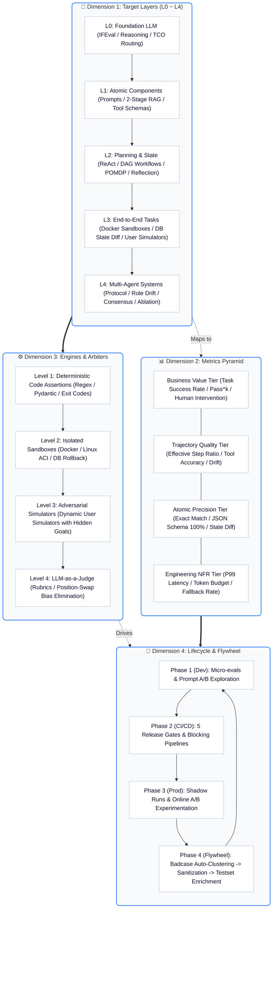

<div align="center">

# 🤖 Awesome Agent Eval

**The Definitive Methodology, Architecture & Engineering Toolkit for AI Agent Evaluation**

[](https://opensource.org/licenses/MIT)
[](https://www.python.org/)
[](https://github.com/)
[](https://awesome.re)

[English](./README_EN.md) | [简体中文](./README.md) | [📚 Whitepaper](./docs/01-framework-and-edd.md) | [🚀 Adoption SOP](./docs/02-enterprise-adoption-sop.md) | [💻 Evaluation Code](./evals/) | [📊 Benchmark Datasets](./datasets/)

</div>

---

## 📖 Mission & 4D Orthogonal Architecture

As LLMs transition into autonomous **AI Agents** capable of planning, tool use, long-term memory, environmental interactions, and multi-agent collaboration, traditional software assertions (`assert response == expected`) and simple QA scores fail catastrophically.

**Awesome Agent Eval** establishes the industry-standard **4D Orthogonal Evaluation Matrix** and **Evaluation-Driven Development (EDD)** paradigm:
* **Dimension 1: Target Layers (What: L0 ~ L4)**: Foundation Models ➔ Atomic Components ➔ Planning & State Machines ➔ End-to-End Sandboxes ➔ Multi-Agent Systems;
* **Dimension 2: Metrics Pyramid (How: 4-Tier Metrics)**: Deterministic Assertions ➔ Trajectory Quality ➔ Business Value ROI ➔ Engineering NFRs;
* **Dimension 3: Execution & Arbiters (Engine: 4 Levels)**: Code Assertions ➔ Docker/ACI Sandboxes ➔ Adversarial Simulators ➔ Position-Swap LLM Judges;
* **Dimension 4: MLOps Lifecycle & Data Flywheel (Lifecycle: Dev to Flywheel)**: Micro-evals ➔ 5 Release Gates ➔ Production Shadow Runs ➔ Badcase Self-Evolving Flywheels.



---

## 📚 12-Chapter Comprehensive Whitepaper Syllabus

| Chapter & Link | Framework Dimension | Core Insights & Practice Guide |
| :--- | :--- | :--- |
| [**01. Framework & EDD**](./docs/01-framework-and-edd.md) | **Foundational Meta-Model** | 4D Orthogonal Architecture, Metrics Pyramid, 5 Dilemmas, and EDD Methodology |
| [**02. Enterprise Adoption SOP**](./docs/02-enterprise-adoption-sop.md) | **Engineering SOP** | Day 1~7 (Cold Start) ➔ Day 8~30 (CI/CD Gates) ➔ Day 31~60 (Simulation) ➔ Day 61~90 (Production Flywheel) |
| [**03. L0 Foundation Model Eval**](./docs/03-l0-foundation-model-eval.md) | **Target Layer L0** | 4-step Selection, IFEval Instruction Following, Needle in a Haystack, and Flagship/SLM Routing TCO |
| [**04. L1 Atomic Components Eval**](./docs/04-l1-atomic-components-eval.md) | **Target Layer L1** | Prompt Micro-Evals, 2-Stage RAG (NDCG/Faithfulness), Tool Calling 5-point Checklist & Anti-Hallucination |
| [**05. L2 Planning & State Eval**](./docs/05-l2-planning-and-state-eval.md) | **Target Layer L2** | ReAct Stability, DAG Workflow Transitions, POMDP State Modeling, Loop Breakers, and Reflection |
| [**06. L3 End-to-End System Eval**](./docs/06-l3-end-to-end-system-eval.md) | **Target Layer L3** | 5-Tier Trajectory Rubric, Docker Physical State Diff (DB/FS), Dynamic User Simulators, Pass^k Robustness |
| [**07. L4 Multi-Agent Systems Eval**](./docs/07-l4-multi-agent-eval.md) | **Target Layer L4** | Protocol Overhead, Role Drift Auditing, Consensus Rounds, Deadlock Detection, and Topology Ablations |
| [**08. Metrics & Judge Arsenal**](./docs/08-metrics-and-judge-arsenal.md) | **Metrics & Arbiters** | Deterministic Code Assertions, NLP/Semantic Metrics (BERTScore), G-Eval Rubrics & Position-Swap Debias |
| [**09. Engineering NFR Eval**](./docs/09-engineering-nfr-eval.md) | **Cross-Cutting NFR** | Perturbation Robustness (Punctuation/Typos), JSON Schema 100% Compliance, API 500 Fallback & Latency |
| [**10. Benchmark Schemas & Datasets**](./docs/10-benchmark-schemas-and-cases.md) | **Global Benchmarks** | In-depth breakdown & JSON Schemas for SWE-bench, OSWorld, Terminal-Bench, and VitaBench |
| [**11. Autonomous Coding & GUI Agents**](./docs/11-autonomous-coding-and-gui.md) | **Vertical Frontiers** | OpenHands (CodeAct EventStream) & SWE-Agent (ACI Interface) Deep Architecture & Sandbox Verification |
| [**12. Release Gates, Platforms & Flywheel**](./docs/12-platform-gates-and-flywheel.md) | **Production & MLOps** | 5 Release Gates, 5-Layer Platform Architecture, Production Data Flywheel, and 25 Engineering FAQs |

---

## ⚡ Quick Start: Running Automated Evals

```bash
# 1. Tool calling precision and anti-hallucination test
python evals/tool_eval_demo.py

# 2. Two-stage RAG evaluation (Retrieval Context Precision & Generation Faithfulness)
python evals/rag_eval_demo.py

# 3. Dynamic multi-turn adversarial User Simulator test
python evals/user_simulator_demo.py

# 4. Position-Swap double-blind LLM judge test (First-position bias elimination)
python evals/swap_judge_demo.py

# 5. Robustness against prompt perturbations, JSON schema validation, and API 500 fallback
python evals/robustness_and_fallback_demo.py
```

---

## 📄 License

This repository is licensed under the [MIT License](./LICENSE).
