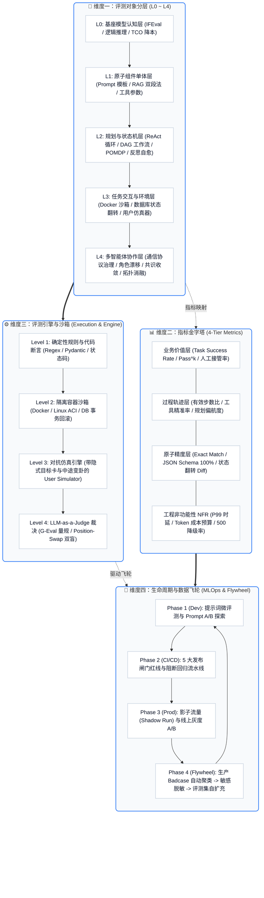
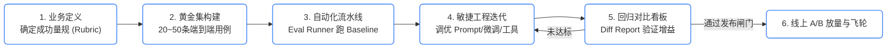

# 01. 体系总览：AI Agent 评测 4 维正交全景架构与 EDD 方法论

> **“在动手搭建一个 Agent 之前，必须先定义‘怎么样算成功’。”**

传统的软件测试依赖确定性的断言（`assert response.status_code == 200`）。然而，当被测对象演进为具备自主规划、工具调用、长期记忆和环境交互能力的 AI Agent 时，传统测试方法全线崩溃。

本章确立 **Awesome Agent Eval** 的顶层理论底座——**4 维正交评测全景架构**、**指标金字塔** 以及 **评估驱动开发（EDD）方法论**。

---

## 🧭 一、 核心理论底座：4 维正交评测全景架构 (The 4D Orthogonal Evaluation Matrix)

一个成熟自洽的工业级评测体系，必须由 **4 个相互正交的维度** 构成坐标系：



---

## 🏛️ 二、 指标金字塔：从确定性断言到业务价值 (Metrics Pyramid)

在 Agent 评测中，严禁把所有指标平铺在一起。必须按照**信噪比**与**业务距离**建立分层：

```
                    ┌───────────────────────────────┐
                    │       4. 业务商业价值层       │
                    │   • 终局任务完成率 (Success Rate)
                    │   • Pass^4 严苛抗抖动通过率   │
                    │   • 人工兜底介入率 (Human Rate)
                    └───────────────┬───────────────┘
                                    │ 依赖上层行为
                    ┌───────────────▼───────────────┐
                    │      3. 轨迹与过程行为层      │
                    │   • 有效步数比 (Efficiency)   │
                    │   • 工具选择幻觉率 (Hallucination)
                    │   • 规划路径偏航度 (Drift)    │
                    └───────────────┬───────────────┘
                                    │ 依赖基础组件
                    ┌───────────────▼───────────────┐
                    │     2. 原子精度与结构合规层   │
                    │   • JSON Schema 100% 结构校验 │
                    │   • Exact Match (EM) 严格一致 │
                    │   • RAG Context Precision/Faithfulness
                    └───────────────┬───────────────┘
                                    │ 全局横切
       ┌────────────────────────────┴───────────────────────────┐
       │                 1. 工程非功能质量 (NFR)                │
       │   • P99 响应时延 (Latency)  • 单次任务 TCO 成本 (Tokens)
       │   • 提示词扰动鲁棒性 (Perturbation) • 500 异常优雅降级率
       └────────────────────────────────────────────────────────┘
```

* **金字塔底层（第 1、2 层）**：属于“守门指标”，成本低、速度快、确定性强，必须在 CI 门禁中作为**阻断项**；
* **金字塔顶层（第 3、4 层）**：属于“胜负指标”，需要真实沙箱、仿真对抗或 LLM Judge 判定，决定了 Agent 能否产生真实的业务 ROI。

---

## 💥 三、 传统测试在 Agent 时代的 5 大核心困境

为什么传统 QA 工程师面对 Agent 会无从下手？

| 困境序号 | 核心痛点 | 工业界表现 | 破局之道 (Solution) |
| :--- | :--- | :--- | :--- |
| **1. 非确定性 (Non-deterministic)** | 相同输入多次运行，由于 Temperature 与上下文微扰，产生完全不同的推理链路 | 传统 `assert output == expected` 频繁误报，自动化测试脆断 | **结果状态翻转断言**（只看沙箱最终环境变化）+ **`Pass^k` 严苛测试** |
| **2. 过程不可见与暗箱决策** | 即使最终答案碰巧蒙对了，中间规划走了 8 步冤枉路或存在危险操作 | 只看最终回答无法识别 Agent 的退化与潜在安全漏洞 | **5 档轨迹比对量规**（检查 Thought-Action-Observation 链路） |
| **3. 失败面组合爆炸** | 零件（Prompt/Tool/RAG）与整机链路（多轮/多 Agent）互相耦合 | 线上挂了排查极为困难，无法定位是模型理解差还是工具返回格式错 | **L0~L4 分层解耦评测**，单体验收与集成验收分离 |
| **4. Benchmark 数据污染** | 开源基准（MMLU、GSM8k）被基座模型预训练数据污染严重 | 榜单得分 90+，上线后业务场景完全不可用 | **构建专有黄金评测集（Private Golden Set）** + 动态仿真器合成测试 |
| **5. 裁判模型偏见 (Judge Bias)** | 使用 LLM 充当裁判时，存在自我偏好、位置偏差与冗长倾向 | 评测结果失真，盲目偏向废话多、风格相似的模型 | **Position-Swap 双盲对调法** + **多裁判交叉共识 (Consensus)** |

---

## 🔄 四、 核心哲学：评估驱动开发 (Evaluation-Driven Development, EDD)

在 Agent 开发中，**“Code is cheap, Evaluation is king”**。没有评测基线的优化，如同在黑暗中掷骰子。



### 传统 TDD 与 Agent EDD 的本质区别：
* **传统 TDD (Test-Driven Development)**：面向**确定性逻辑**，通过写 Unit Test 锁定输入输出，代码满足边界即完成。
* **Agent EDD (Evaluation-Driven Development)**：面向**概率性决策**，通过构建**黄金基准集与自动化评估沙箱**，持续量化 Prompt 变体、模型微调、工具扩充带来的正负收益（Net Win Rate），确保系统向业务目标单调演进。

---

## 📚 五、 12 阶渐进式体系路线与全书导航

全书按照 **体系总览 ➔ 实施落地 ➔ 对象分层 (L0~L4) ➔ 指标与工程 ➔ 前沿基准 ➔ 生产中台** 的完整脉络编排：

| 章节与链接 | 核心维度归属 | 核心攻坚要点 |
| :--- | :--- | :--- |
| [**01. 体系总览与 EDD**](./01-framework-and-edd.md) | **方法论总纲** | 4 维正交全景架构、指标金字塔、5 大困境与 EDD 核心哲学 |
| [**02. 企业落地实战 SOP**](./02-enterprise-adoption-sop.md) | **工程落地** | Day 1~7 冷启动 ➔ Day 8~30 CI/CD ➔ Day 31~60 仿真 ➔ Day 61~90 生产飞轮 |
| [**03. L0 基座模型评测与选型**](./03-l0-foundation-model-eval.md) | **对象分层 L0** | 指令遵循画像 (IFEval)、长文本针中寻草与大小模型分流 TCO 降本架构 |
| [**04. L1 原子组件单体评测**](./04-l1-atomic-components-eval.md) | **对象分层 L1** | Prompt 模板效能、RAG 检索/生成双段量化 (NDCG/Faithfulness)、工具调用 5 项核对与反例防幻觉 |
| [**05. L2 规划与状态机评测**](./05-l2-planning-and-state-eval.md) | **对象分层 L2** | ReAct 循环稳定性、DAG 跃迁、POMDP 复杂度建模、死循环拦截与反思自愈评估 |
| [**06. L3 任务交互与沙箱评测**](./06-l3-end-to-end-system-eval.md) | **对象分层 L3** | 5 档轨迹比对、Docker 沙箱真实状态翻转 (DB/FS Diff)、动态 User Simulator 对抗博弈 |
| [**07. L4 多智能体协作评测**](./07-l4-multi-agent-eval.md) | **对象分层 L4** | 通信协议开销、角色漂移 (Role Drift)、协作共识收敛度、死锁拦截与拓扑消融分析 |
| [**08. 核心度量衡与裁判武器库**](./08-metrics-and-judge-arsenal.md) | **指标与引擎** | 确定性断言、NLP 统计与语义度量 (BERTScore)、G-Eval 量规与 Position-Swap 双盲消偏 |
| [**09. 工程非功能质量维度 (NFR)**](./09-engineering-nfr-eval.md) | **横向工程属性** | 输入扰动鲁棒性 (标点/错别字)、JSON Schema 100% 合规、API 500 优雅降级与成本时延 |
| [**10. 权威基准与数据规范**](./10-benchmark-schemas-and-cases.md) | **基准深度剖析** | SWE-bench (代码)、OSWorld (操作系统)、Terminal-Bench (运维)、VitaBench (生活服务) 标准规范 |
| [**11. 自主编程与 GUI 智能体专题**](./11-autonomous-coding-and-gui.md) | **垂直前沿** | OpenHands (CodeAct) 与 SWE-Agent (ACI 架构) 自主编程架构拆解与沙箱评测实战 |
| [**12. 生产闸门与评测平台闭环**](./12-platform-gates-and-flywheel.md) | **生产与生态** | 5 大发布红线、企业级评测中台 5 层架构、生产数据飞轮闭环与 25 个避坑 FAQ |
