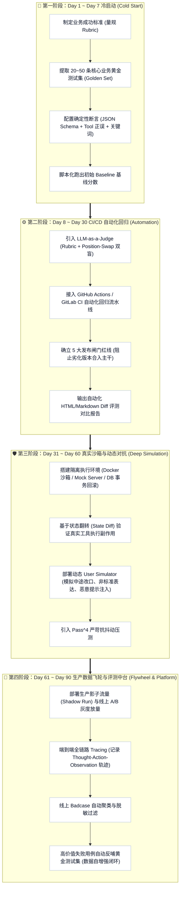

# 02. 企业落地演进路线：从 0 到 1 构建 Agent 评测中台实战 SOP

很多企业与算法工程团队在落地 Agent 评测时，往往陷入两个极端：
* **极端一（好高骛远）**：一开始就试图搭建百人分布式沙箱、接入数十个开源基准，结果由于投入巨大、与业务脱节，项目最终烂尾；
* **极端二（放任自流）**：靠几个工程师每天肉眼看 5 个 Prompt 对话，“凭感觉上线”，上线后只要用户改动一个词，生产直接崩溃。

本章提供经过多家大厂验证的 **Day 1 到 Day 90 四阶段演化路线图（SOP）** 与 **评测成熟度模型（CMMI L1~L5）**。

---

## 🧭 一、 企业评测中台演进四阶全景图

---

## 📋 二、 分阶段落地实操 SOP 手册

### Phase 1：Day 1 ~ Day 7 冷启动（建立第一条基线）
* **核心目标**：绝不搞复杂平台，用最小成本摆脱“肉眼盲猜”，建立量化标尺。
* **交付物清单**：
  1. `golden_set_v1.json`：包含 30 个高频业务场景用例（20 个正向业务流、5 个反例防幻觉、5 个边缘异常）；
  2. `eval_runner.py`：单脚本顺序执行用例，记录结果；
  3. `baseline_report.md`：记录当前版本通过率（例如：工具准确率 72%，Schema 合规率 85%）。
* **必须避免的坑**：不要一开始就引入复杂的 LLM Judge 打分，优先用 Python 代码做严格断言（工具名匹配、必填字段存在性、状态码）。

### Phase 2：Day 8 ~ Day 30 自动化门禁（守护质量底线）
* **核心目标**：把评测固化到研发流程中，确保每次修改 Prompt 或切换模型时，绝不发生隐性质量回退。
* **交付物清单**：
  1. `.github/workflows/agent_eval.yml`：代码提交或 PR 时自动触发运行；
  2. `release_gates.json`：定义阻断阈值（工具精准率必须 100%，Schema 合规率 100%，整体 Pass Rate >= 85%）；
  3. 引入首位偏差治理（Position Swap 双盲裁决），对开放式回答进行 1-5 分量规打分。

### Phase 3：Day 31 ~ Day 60 深度仿真与沙箱（攻克复杂场景）
* **核心目标**：脱离单轮 Mock，进入长链路交互与环境副作用校验。
* **交付物清单**：
  1. Docker 沙箱集群或标准化 Mock API 网关（支持调用后查询 DB 状态并重置）；
  2. 动态 User Simulator 配置（如：订票过程中突然提出“改签到后天下午”，检验 Agent 的状态保持与动态调度能力）；
  3. `Pass^4` 评测：每个复杂用例独立跑 4 次，全通过才计为 1 分，彻底暴露模型小概率随机抽搐问题。

### Phase 4：Day 61 ~ Day 90 生产数据飞轮（自进化闭环）
* **核心目标**：评测集永远不能是静态死水，必须从线上真实失败中持续吸血进化。
* **交付物清单**：
  1. 线上可观测性治理（OpenTelemetry / LangSmith / 自研 Tracing 收集完整轨迹）；
  2. Badcase 自动化流转通道：用户点“踩”、人工兜底接管或工具报错的 Session，自动被打标并推入聚类分析队列；
  3. 自动脱敏与合成用例转化器，每周自动向 `golden_set.json` 新增 5~10 条经过清洗的“防重蹈覆辙”测试用例。

---

## 👥 三、 角色分工与协作矩阵 (RACI Matrix)

| 交付环节 | 算法工程师 (Model/Prompt) | 测试开发工程师 (QA/Eval) | 业务产品经理 (PM) |
| :--- | :---: | :---: | :---: |
| **制定量规 (Rubric) 与业务目标** | 咨询 (C) | 协助 (A) | **负责 (R)** |
| **构建高价值业务黄金测试集** | 协助 (A) | **负责 (R)** | **负责 (R)** |
| **评测执行引擎与沙箱环境搭建** | 协助 (A) | **负责 (R)** | 知情 (I) |
| **Prompt 迭代与微调优化** | **负责 (R)** | 协助 (A) | 知情 (I) |
| **发布闸门审查与灰度签署** | **负责 (R)** | **负责 (R)** | **负责 (R)** |
| **线上 Badcase 归因与飞轮扩充** | 协助 (A) | **负责 (R)** | 咨询 (C) |

---

## 📈 四、 企业 Agent 评测成熟度模型 (CMMI L1~L5)

| 等级 | 阶段名称 | 典型特征 | 工业界痛点 | 升级关键跃迁动作 |
| :---: | :--- | :--- | :--- | :--- |
| **L1** | **初级人肉肉搏 (Ad-hoc)** | 靠工程师每天手动跑几个 Prompt 凭肉眼感觉打分 | 上线即宕机，改一个字引发雪崩，无法量化进展 | 沉淀首批 20 条固定黄金测试集，用脚本自动化跑 |
| **L2** | **单体断言阶段 (Automated Unit)** | 有了测试集与自动化脚本，基于 JSON Schema 和工具名断言 | 只能测简单步骤，无法测长链规划与复杂对话 | 接入 CI/CD 流水线，确立不可退化的发布闸门 |
| **L3** | **仿真与量规化 (Simulation & Rubrics)** | 引入 LLM-as-a-Judge、双盲消偏与动态 User Simulator 交互 | 缺乏真实系统副作用验证，测试环境与生产数据脱节 | 搭建容器隔离沙箱与 DB 状态比对验证系统 |
| **L4** | **全链路可观测 (Observable & CI/CD)** | 线上线下打通，全链路 Tracing，具备严格发布红线门禁 | Badcase 需要人工手动翻日志挑出来整理，费时费力 | 建立自动化 Badcase 聚类分析与脱敏回流流水线 |
| **L5** | **自进化数据飞轮 (Self-Evolving Flywheel)** | 生产流量持续清洗自反哺测试集，模型持续自我博弈强化 | 行业顶尖形态，如 OpenAI / 顶尖大厂内部评测中台 | 完善自动化红队渗透 (Red Teaming) 与策略迭代闭环 |
