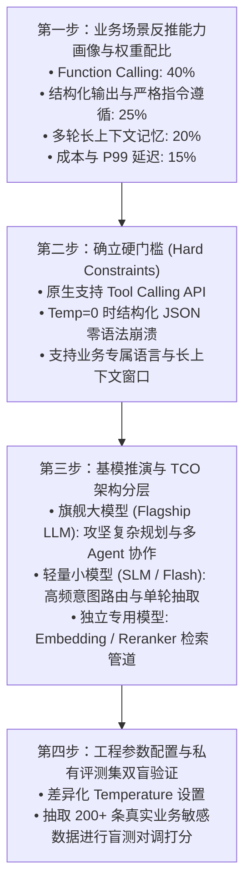

# 03. L0 基座模型评测：能力画像、长文本与 TCO 选型降本

在构建 AI Agent 时，基座模型（Foundation LLM）是智能的引擎。但工业界最大的误区是：**盲目崇拜公开排行榜（如 LMSYS Chatbot Arena、MMLU），谁排第一就选谁**。
基模评测必须建立在真实业务场景的反推画像上，并通过 **TCO 架构分层** 达成性能与成本的极致平衡。

---

## 🧭 一、 L0 评测定位：基模评测为何不等同于 Agent 评测？

* **通用能力 vs 智能体能力**：很多通用跑分极高的模型，一旦放入 Agent 的 ReAct 循环或复杂的 Tool Calling 依赖图中，经常出现参数格式破坏、中途失忆或死循环；
* **单轮问答 vs 长链路指令遵循**：Agent 需要严格遵循系统提示词（System Prompt）中长达数千字的约束条款，对严格负向约束（“绝不允许...”）的服从率要求达到 99.9%。

---

## 🎯 二、 基模选型四步法全景流程



---

## 🔬 三、 基座模型核心维度评测方法

### 1. 指令遵循评测 (Instruction Following / IFEval)
* **评测机制**：不评估主观文采，只做可编程的刚性语法断言（如“字数严格在 200~300 字”、“包含特定关键词”、“以 JSON 格式输出且不得包含任何 Markdown 标记”）；
* **指标**：Strict Pass Rate（严格符合率）与 Loose Pass Rate。

### 2. 原生工具调用能力 (BFCL 标杆)
* **评测机制**：基于 Berkeley Function-Calling Leaderboard (BFCL) 模式，测试复杂多工具场景下的：
  * 单工具调用准确率 (Single-turn AST match)；
  * 多工具组合调用能力 (Multi-turn & Parallel call)；
  * 错误参数反馈自纠错能力。

### 3. 长文本保真度与“针中寻草” (Needle in a Haystack)
* **评测机制**：在 32K ~ 128K 长度的背景文档中，随机插入一条不相关的特定事实（“针”），要求模型在不同位置（开头 10%、中间 50%、末尾 90%）精准检索并回答；
* **Agent 意义**：长多轮 Agent 对话中，早期用户提供的信息能否在 20 轮后依旧被精准调用，直接取决于此项能力。

---

## 💰 四、 总体拥有成本 (TCO) 架构优化与分流设计

如果所有用户请求都无脑调用顶级旗舰模型，API 成本与时延将不可承受。必须在架构层面实施**任务分级与模型分流**：

```
                              ┌────────────────────────────────────────┐
                              │ 用户输入请求 (User Inbound Request)    │
                              └──────────────────┬─────────────────────┘
                                                 │
                                                 ▼
                              ┌────────────────────────────────────────┐
                              │ 意图路由层 (Router Agent)               │
                              │ [采用超低成本小模型, Temp = 0.0]       │
                              └──────┬──────────────────────────┬──────┘
                                     │                          │
                        (简单高频任务 / 常见咨询)       (复杂多步规划 / 跨工具调度)
                                     │                          │
                                     ▼                          ▼
                  ┌──────────────────────────────┐   ┌──────────────────────────────┐
                  │ 轻量模型 (SLM / Flash Tier)  │   │ 旗舰模型 (LLM / Flagship Tier)│
                  │ • 意图分类与简单抽取         │   │ • 复杂反思与 ReAct 循环     │
                  │ • 单轮 FAQ 问答              │   │ • 多 Agent 协作与代码执行    │
                  │ • 成本降低 85%+, 时延 <300ms │   │ • 保证端到端高成功率         │
                  └──────────────────────────────┘   └──────────────────────────────┘
```

---

## ⚙️ 五、 差异化工程推理参数配置矩阵

在工程落地中，同一个基座模型应按子任务性质配置不同的推理超参数：

| 子任务类型 | 确定性要求 | 创造性要求 | 推荐 Temperature | 推荐 Top-P | 核心断言方式 |
| :--- | :---: | :---: | :---: | :---: | :--- |
| **意图分类 / 路由** | 极高 | 无 | `0.0` | `1.0` | 精确匹配 (EM) |
| **工具参数抽取 / JSON 生成** | 极高 | 无 | `0.0` | `1.0` | JSON Schema 校验 |
| **RAG 知识库问答** | 高 | 低 | `0.2 ~ 0.3` | `0.9` | Faithfulness (忠实度) |
| **开放式推荐 / 话术生成** | 中 | 高 | `0.7 ~ 0.8` | `0.95` | LLM-as-a-Judge (Rubric) |
