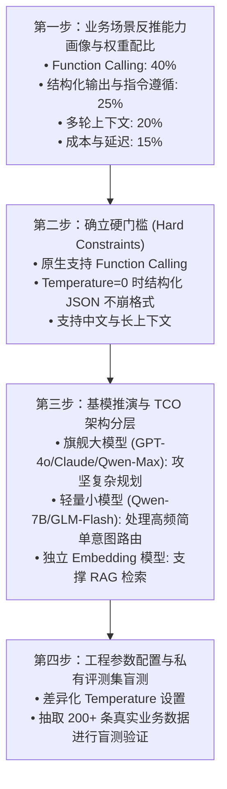

# 03. 基模选型四步法与 TCO 架构降本

选型不是“看公开排行榜谁第一就用谁”，而是一条严密的决策链：**“场景 ➔ 能力画像 ➔ 硬门槛初筛 ➔ 私有集双盲验证 ➔ TCO 架构降本”**。

---

## 1. 模型选型四步法全景流程



---

## 2. 总体拥有成本 (TCO) 架构优化与分流设计

如果所有用户请求都无脑调用顶级旗舰模型，API 成本与时延将不可承受。必须在架构层面实施**任务分级与模型分流**：

```
                              ┌────────────────────────────────────────┐
                              │ 用户输入请求 (User Inbound Request)    │
                              └──────────────────┬─────────────────────┘
                                                 │
                                                 ▼
                              ┌────────────────────────────────────────┐
                              │ 意图路由层 (Router Agent)               │
                              │ [采用超低成本小模型, Temp = 0.0]       │
                              └──────┬──────────────────────────┬──────┘
                                     │                          │
                        (简单高频任务 / 常见咨询)       (复杂多步规划 / 跨工具调度)
                                     │                          │
                                     ▼                          ▼
                  ┌──────────────────────────────┐   ┌──────────────────────────────┐
                  │ 轻量模型 (SLM / Flash Tier)  │   │ 旗舰模型 (LLM / Flagship Tier)│
                  │ • 意图分类与简单抽取         │   │ • 复杂反思与 ReAct 循环     │
                  │ • 单轮 FAQ 问答              │   │ • 多 Agent 协作与代码执行    │
                  │ • 成本降低 85%+, 时延 <300ms │   │ • 保证端到端高成功率         │
                  └──────────────────────────────┘   └──────────────────────────────┘
```

---

## 3. 差异化工程参数配置矩阵

在工程落地中，同一个模型应按子任务性质配置不同的推理超参数：

| 子任务类型 | 确定性要求 | 创造性要求 | 推荐 Temperature | 推荐 Top-P | 核心断言方式 |
| :--- | :---: | :---: | :---: | :---: | :--- |
| **意图分类 / 路由** | 极高 | 无 | `0.0` | `1.0` | 精确匹配 (EM) |
| **工具参数抽取 / JSON 生成** | 极高 | 无 | `0.0` | `1.0` | JSON Schema 校验 |
| **RAG 知识库问答** | 高 | 低 | `0.2 ~ 0.3` | `0.9` | Faithfulness (忠实度) |
| **开放式推荐 / 话术生成** | 中 | 高 | `0.7 ~ 0.8` | `0.95` | LLM-as-a-Judge (Rubric) |
