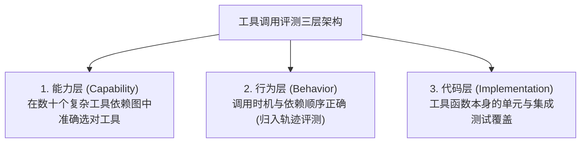

# 04. 四大核心零件单体评测 (Component Evaluation)

Agent 是由多个组件拼装而成的复杂系统：**零件不合格，整机绝不可能合格**。在进行端到端集成测试前，必须对四大核心组件进行独立单体测试。

---

## 1. Prompt 评测（质量、自动化与防御性）

* **质量批量评测**：借助 Microsoft Prompt Flow 或 LangSmith 构建 DAG 评估流，使用 JSONL 批量注入多组参数变体，通过 `aggregate.py` 统计指标分布。
* **防御性评测**：
  * **鲁棒性测试**：注入语法轻微错乱、同义词替换，验证输出稳定性；
  * **安全性测试**：执行直接/间接 Prompt 注入攻击，验证系统防御边界。

---

## 2. RAG 检索双段评测法（检索段 vs 生成段）

RAG 遵循“先检索、后生成”流程。如果检索结果包含错误或无关信息，后续生成就是“一本正经地胡说八道”。

```
┌─────────────────────────────────────────────────────────────┐
│ 🔍 阶段一：检索段评测 (Retrieval Stage)                       │
│    • Context Precision (上下文精确率): 召回的切片中相关比例  │
│    • Context Recall (上下文召回率): 应该找回的关键证据比例   │
│    • Ranking Quality: NDCG@k, MAP, MRR 排序评估              │
├─────────────────────────────────────────────────────────────┤
│ ✍️ 阶段二：生成段评测 (Generation Stage)                      │
│    • Faithfulness (生成忠实度): 回答应完全扎根于证据，零幻觉│
│    • Answer Relevance (回答相关性): 是否直接回答了用户问题   │
└─────────────────────────────────────────────────────────────┘
```

---

## 3. 工具调用评测 (Tool Calling Evaluation)

工具调用是 Agent 与外界交互的“手”，评测涵盖三大层级：



### 📋 4 项参数逐项核对与反例注入：
1. **工具选择**：Tool Name 是否与预期完全一致；
2. **必填参数完整性**：Required 参数是否全部提供；
3. **参数幻觉拦截**：是否存在捏造的不存在参数；
4. **参数类型与格式**：如日期格式 `YYYY-MM-DD` 校验；
5. **🛡️ 注入反例（防工具幻觉）**：输入纯闲聊与无需调工具的问题，断言 `tools_called == []`。

---

## 4. 规划与推理评测 (Planning & Reasoning Evaluation)

工具调用管“手”，规划推理管“脑”。

### 🧠 3 大典型规划失败模式：
1. **决策与选步错误**：走了无谓的弯路或选错了工具链路；
2. **目标与约束违背 (Constraint Violation)**：例如约到了营业时间之外，预算超支；
3. **反思错误 (Reflection Error)**：底层任务因网络报错未实际完成，Agent 却误以为成功而提前收工。

### 📊 评估指标：
* **有效计划生成率 (Valid Plan Ratio)**；
* **平均重试步数 (Mean Iterations to Success)**；
* **自我一致性 (Self-Consistency 多数投票一致率)**。
