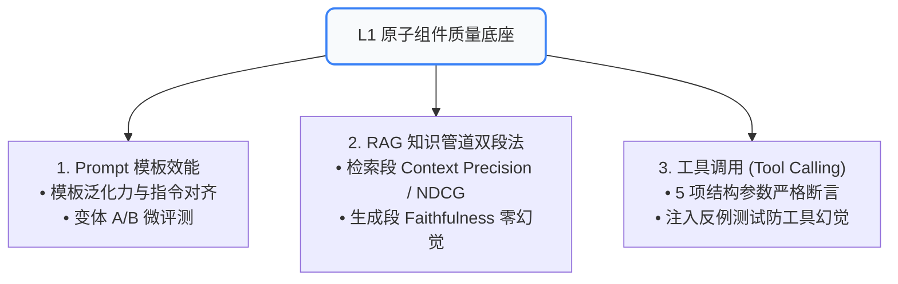

# 04. L1 原子组件单体评测：Prompt 模板、RAG 双段法与工具调用

Agent 是由多个核心原子组件装配而成的复杂系统：**零件不合格，整机绝不可能合格**。在进行端到端全链路集成前，必须对 Prompt、RAG 检索管道与工具调用进行严格的原子级单体评测。

---

## 🧭 一、 L1 原子组件评测定位



---

## 📝 二、 Prompt 模板效能与微评测 (Prompt Micro-Eval)

提示词是驱动大模型的底层程序。微评测关注 Prompt 在参数变量批量注入下的**质量稳定性与防御性**：

### 1. 批量质量评测 (Batch Execution)
* 构建变量测试用例集（如 `input_data.jsonl`），借助测试脚本批量替换占位符并驱动推理；
* 统计输出在目标任务上的通过率分布，对比基线版本的 **净胜率 (Net Win Rate)**。

### 2. 提示词变体对比 (Prompt A/B Testing)
* **Few-shot 示例增减**：测试从 0-shot 增加至 3-shot 时的边际增益与额外 Token 成本；
* **结构化格式引导**：对比“自由文本”与“Markdown / XML 标签包裹”对模型遵循准确率的提升幅度。

---

## 🔍 三、 RAG 检索管道双段评测法 (Two-Stage RAG Evaluation)

RAG 绝不能只评测最终回答通不通顺，必须把**“检索段”**和**“生成段”**彻底拆解：

```
┌─────────────────────────────────────────────────────────────────────────────┐
│ 🔍 阶段一：检索段评测 (Retrieval Stage - 解决“找得全不全、准不准”)           │
│    • Context Precision (上下文精确率): 召回切片中真正包含答案的比例         │
│    • Context Recall (上下文召回率): 黄金标准切片被命中的比例                │
│    • Ranking Quality (NDCG@k / MRR): 最关键的核心证据是否排在 Top 1~3       │
├─────────────────────────────────────────────────────────────────────────────┤
│ ✍️ 阶段二：生成段评测 (Generation Stage - 解决“根据检索证据回答得好不好”)   │
│    • Faithfulness (生成忠实度): 回答中的每一句断言是否都完全扎根于切片     │
│    • Answer Relevance (回答相关性): 生成内容是否切中用户意图，杜绝跑题       │
└─────────────────────────────────────────────────────────────────────────────┘
```

### 🔬 关键工程断言：
* **切片策略对比**：固定切分（Fixed 256/512 tokens）vs 递归语义切分（Recursive Character）的召回率收益；
* **Reranker 增益验证**：引入 Cross-Encoder 重排模型后，NDCG@3 指标提升必须 $\ge 15\%$ 方可上线。

---

## 🛠️ 四、 工具调用 (Tool Calling) 评测：5 项核对与反例注入

工具调用是 Agent 与外部真实世界交互的“手”。调用错误会导致严重业务事故。

### 📋 5 项严格参数核对标准：
1. **工具名称匹配 (Tool Name Match)**：Tool Name 是否与目标工具完全一致（精确匹配）；
2. **必填参数完整性 (Required Params Check)**：Schema 中定义的必填参数是否 100% 具备；
3. **参数幻觉拦截 (Parameter Hallucination)**：是否捏造了 Schema 中不存在的冗余参数；
4. **参数类型与格式约束 (Type & Format Validation)**：如日期格式 `YYYY-MM-DD`、数值范围校验；
5. **🛡️ 注入反例（防工具幻觉测试）**：
   * 输入纯闲聊（“你好”、“讲个笑话”）或缺少上下文无法执行的任务；
   * **断言**：`tools_called == []`（严禁模型在不需要调工具时胡乱调工具）。

### 💻 实战代码：
运行项目中提供的工具评测自动化脚本进行验证：
```bash
python evals/tool_eval_demo.py
```
