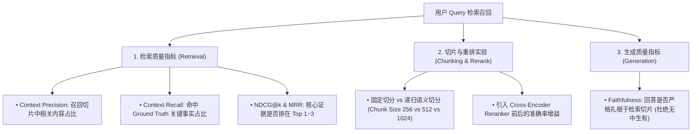
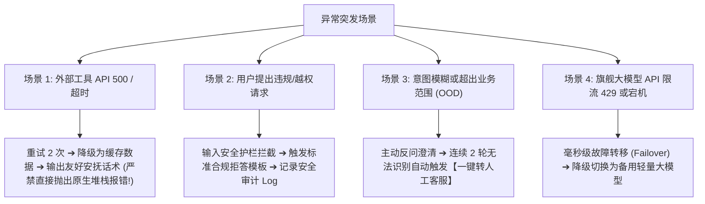

# 11. 四大核心工程质量维度：RAG 效果、提示词稳定性、返回质量与异常兜底

在工业级 Agent 落地中，除了前沿 Benchmark 之外，日常测试开发面临最多的是 **四大核心工程质量瓶颈**。本章详细拆解这四大维度的度量指标、测试方法与工程断言标准。

---

## 🧭 四大核心工程质量全景矩阵

```
┌─────────────────────────────────────────────────────────────────────────────┐
│ 1. RAG 检索效果评测 (Retrieval Effectiveness)                               │
│    • Context Precision (精确率), Context Recall (召回率), NDCG@k / MRR      │
│    • Chunking 切片策略对比与 Reranker 重排序收益量化                         │
├─────────────────────────────────────────────────────────────────────────────┤
│ 2. 工作流与提示词稳定性 (Prompt & Workflow Robustness)                      │
│    • 扰动测试 (Perturbation): 标点/空格/同义词轻微变动下的指令遵循抗抖动    │
│    • DAG 工作流与 ReAct 循环稳定性 (死循环拦截、最大步数限制、状态机跃迁)    │
├─────────────────────────────────────────────────────────────────────────────┤
│ 3. 模型返回质量与结构合规 (Output Quality & Schema Integrity)               │
│    • JSON Schema 100% 结构严格合规率 (Pydantic / Regex 自动化校验)          │
│    • 幻觉率 (事实幻觉 / 工具幻觉 / 槽位凭空捏造)、生成忠实度 (Faithfulness) │
├─────────────────────────────────────────────────────────────────────────────┤
│ 4. 异常兜底与容错恢复 (Exception Handling & Fallback Guardrails)            │
│    • 工具异常降级 (API 500 / 超时 / 429 限流时的优雅重试与用户安抚话术)     │
│    • 越权与超范围优雅拒答 (Out-of-Domain Refusal)、人工介入升级率 (Human-in-Loop)│
│    • 熔断降级 (主模型故障毫秒级自动切换备用轻量模型)                        │
└─────────────────────────────────────────────────────────────────────────────┘
```

---

## 一、 RAG 检索效果评测体系 (RAG Effectiveness)

RAG 绝不能只看“生成的回答通不通顺”，必须将**“检索段”**和**“生成段”**拆解评估：



---

## 二、 工作流与提示词稳定性评测 (Prompt & Workflow Robustness)

提示词是 Agent 最敏感的控制旋钮。**一次空格、标点或口语化错别字绝不能导致 Agent 行为崩塌**。

### 1. 提示词扰动鲁棒性测试 (Prompt Perturbation Testing)
* **测试方法**：对黄金测试集中的 Prompt 注入 3 类常见扰动：
  * **格式扰动**：连续多空格、首尾空格、中英文标点混用（`，` vs `,`）；
  * **同义词与语序扰动**：“帮我订明天去北京的高铁” ➔ “明天去北京的火车票帮我买一张”；
  * **轻微错别字**：“订机标”、“查天汽”。
* **合格标准**：语义解析与工具选择一致率必须 $\ge 98\%$。

### 2. 工作流与 ReAct 循环稳定性
* **死循环熔断器（Max Step Guardrail）**：硬性限制单任务最大推理步数（如 `max_iterations = 8`）；
* **重复动作检测**：检测 Agent 是否在连续 3 轮执行相同的无效工具调用；
* **DAG 状态机合法跃迁**：严禁跳过前置审核直接进入下单扣款节点。

---

## 三、 模型返回质量与结构合规 (Output Quality)

### 1. JSON 结构化 100% 严格合规
* 在调用外部工具或给前端提供数据时，返回必须符合预定义的 Pydantic / JSON Schema；
* **测试维度**：
  * 字段缺失率（Missing Keys）；
  * 类型错乱率（如日期格式 `2026/08/28` 违背 `YYYY-MM-DD`、整型传成字符串）；
  * Markdown 格式污染（是否在纯 JSON 模式下额外输出了 ` ```json ` 导致解析器崩溃）。

### 2. 幻觉率量化监控
* **事实性幻觉**：输出与知识库事实冲突；
* **工具幻觉**：调用了不存在的函数或传递了不存在的参数；
* **槽位虚构**：用户没说要微辣，Agent 却擅自在参数中填写了微辣。

---

## 四、 异常兜底与容错恢复 (Exception Fallback & Guardrails)

一个合格的工业级 Agent，**在 80% 的正常流程下稳定，在 20% 的异常突发下依然具备自愈与优雅兜底能力**。



---

## 💻 工业级异常兜底断言代码示例 (Python & Pytest)

```python
def test_agent_tool_error_graceful_fallback():
    """
    测试当外部天气 API 发生 500 崩溃时，Agent 是否能优雅兜底而不是直接崩溃报异常。
    """
    agent = WeatherAgent(mock_tool_fail=True)  # 模拟外部 API 故障
    response = agent.chat("请帮我查一下北京天气")
    
    # 1. 严禁向用户暴露底层代码异常与 Traceback
    assert "Traceback" not in response
    assert "Exception" not in response
    assert "500 Internal Server Error" not in response
    
    # 2. 必须包含友好的降级安抚话术，并给出替代建议
    assert "抱歉" in response or "暂时无法获取" in response
    assert agent.fallback_triggered is True
```
