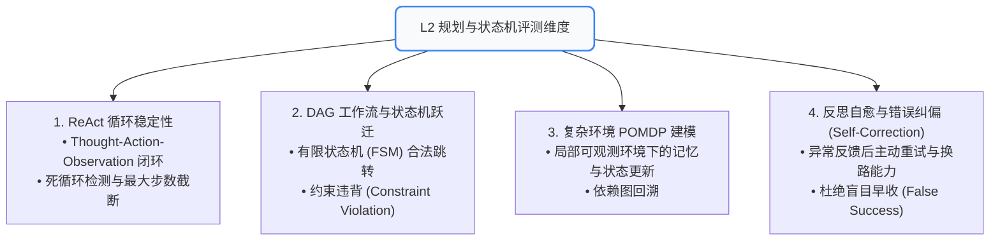
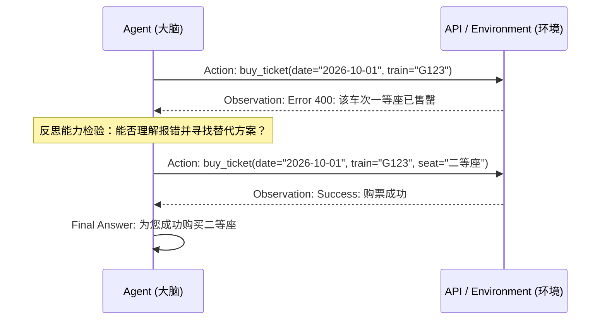

# 05. L2 规划与状态机评测：ReAct 循环、DAG 跃迁与反思自愈

当单步工具调用与原子组件稳定后，Agent 的核心考验在于**多步复杂任务的自主规划与决策编排**。
L2 规划层评测负责评估 Agent 的“大脑”：在不确定性环境中能否保持清晰逻辑、合规跃迁，并在遭遇失败时自发纠偏。

---

## 🧭 一、 L2 规划与决策层评测全景



---

## 🔄 二、 ReAct 循环稳定性评测 (ReAct Loop Stability)

ReAct 模式（Reasoning + Acting）是 Agent 自主推理的基础。

### 🚨 典型的 ReAct 规划三大死穴：
1. **死循环震荡 (Infinite Action Loop)**：Agent 反复以完全相同的参数调用同一个工具（如不断重复查询同一张空列表），耗尽上下文；
2. **步数失控 (Step Explosion)**：原本 3 步可完成的任务，Agent 散漫执行了 15 步无意义探索；
3. **观测丢失 (Observation Ignorance)**：工具明明返回了关键数据，Agent 在下一步 Thought 中却无视该数据，继续瞎猜。

### 📊 核心度量指标：
* **死循环率 (Infinite Loop Rate)**：重复动作连续出现 $\ge 3$ 次的用例占比，目标值必须为 $0\%$；
* **有效步数比 (Effective Step Ratio)**：$rac{	ext{黄金参考最短步数}}{	ext{实际执行总步数}}$，衡量规划的紧凑性与经济性；
* **早停拦截率**：达到 `max_iterations` 限制前主动输出 Final Answer 的比例。

---

## 🔀 三、 DAG 工作流与状态机跃迁评测 (Workflow & FSM Integrity)

在企业级落地中，大部分生产 Agent 都被约束在有限状态机（FSM）或有向无环图（DAG）内运转。

```
[初始化状态] ➔ (资质校验) ➔ [已鉴权] ➔ (参数收集) ➔ [就绪] ➔ (执行转账) ➔ [完成]
                                  │
                                  ▼ (状态异常)
                              [人工审核]
```

### 📋 状态跃迁断言要点：
* **非法跨状态跃迁拦截**：未经过鉴权状态，直接跃迁到转账执行状态，判定为严重越权；
* **必要前置条件检查**：状态迁移前必须先满足前置条件（如确认收货地址与手机号已填写）；
* **约束违背率 (Constraint Violation Rate)**：例如预订超过用户预算的酒店、在营业时间外安排会议。

---

## 🧠 四、 复杂环境 POMDP 状态维护评测

在部分可观测马尔可夫决策过程（POMDP）中，环境信息并非一次性全量给定，Agent 需要边走边探索。
* **状态一致性维持**：多轮长链路交互中，已确认的实体槽位（如“用户去北京，乘高铁”）在经历 5 轮探索后不得丢失；
* **信息增益度量**：每一次 Action 必须为决策树引入正向的熵减，杜绝盲目空转。

---

## 🛡️ 五、 反思自愈与错误纠偏评测 (Self-Correction & Reflection)

优秀的 Agent 不在于“绝不犯错”，而在于“被外界报错拒绝后能够快速换一条路走通”。



### 📊 反思评测四大度量衡：
1. **报错理解率**：能否从 Observation 中的报错信息准确归因；
2. **纠偏成功率 (Self-Correction Success Rate)**：遭遇环境 4xx/5xx 或约束报错后，在 2 轮内成功修复的比例；
3. **盲目虚报拦截 (False Success Prevention)**：底层工具实际调用失败，Agent 却在回答中谎称“已为您办理成功”，此类事故直接记为 0 分一票否决。
