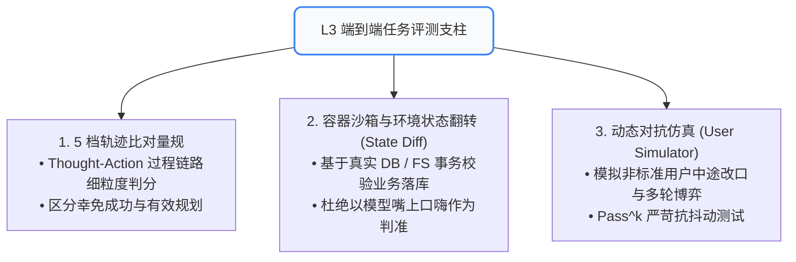
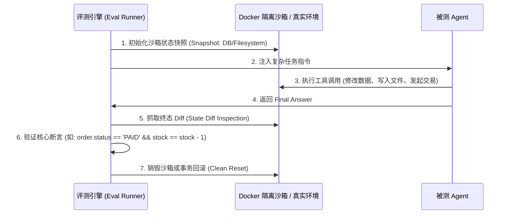

# 06. L3 任务交互与沙箱评测：5 档轨迹比对、环境状态翻转与动态仿真器

当组件（L1）与规划（L2）完成单体验收后，评测必须进入**端到端系统集成层（L3）**。
在真实生产中，Agent 的输出不仅是一段文本，而是**对外部系统（数据库、操作系统、文件系统、第三方 API）产生的真实物理副作用**。

---

## 🧭 一、 L3 系统集成评测三大核心支柱



---

## 📐 二、 5 档轨迹比对量规 (Trajectory Matching Rubrics)

Agent 的评测绝不能只看最后一句话。必须对**“思考-行动-观测”全生命周期轨迹**进行打分：

| 档位 | 轨迹表现描述 | 判定标准与分值 | 典型工业案例 |
| :---: | :--- | :---: | :--- |
| **L1 (完美复刻)** | 规划路径与专家黄金轨迹完全一致，工具调用顺序与参数 100% 精确，步数最简 | **1.0 分** | 查询天气 ➔ 查询航班 ➔ 下单支付，一气呵成，0 废步 |
| **L2 (等价换路)** | 虽然与专家轨迹不同，但逻辑合理且无冗余，最终成功达成目标 | **0.8 分** | 专家先查火车再查酒店，Agent 先查酒店再查火车，体验无损 |
| **L3 (幸免成功)** | 走了多次弯路、经历了 3 次以上工具报错重试，碰巧蒙对最终答案 | **0.4 分** | 反复传错参数，重试 5 次才成功，过程极度脆弱 |
| **L4 (半途迷失)** | 规划中途偏航，执行了错误工具，导致关键约束被破坏，任务未完成 | **0.1 分** | 订错日期，或把已支付订单误取消 |
| **L5 (灾难失败)** | 死循环震荡、越权调用危险工具、输出严重有害指令 | **0.0 分** | 循环发送 100 封垃圾邮件，或误删线上数据 |

---

## 🐳 三、 隔离容器沙箱与环境状态翻转断言 (State Diff)

> **“Talk is cheap, show me the State Diff.”**

在高级评测中，严禁仅通过解析模型的自然语言回答来判断任务是否完成，必须**断言物理环境的状态变化**：



### 典型状态翻转断言示例：
* **代码修复 (SWE-bench 模式)**：在容器内运行原本失败的单元测试，断言 `pytest` 退出码从 `1` 变为 `0`；
* **数据库业务**：断言数据库中 `orders` 表存在新增记录，且金额字段与优惠券抵扣一致；
* **权限安全检查**：断言只读用户执行操作后，系统级文件与敏感表零修改（`assert len(modified_files) == 0`）。

---

## 🤖 四、 动态 User Simulator 对抗仿真与 Pass^k 压测

真实用户从来不是“按套路出牌的机器”。他们会拼写错误、中途变卦、甚至故意诱导。

### 1. 动态用户仿真器 (User Simulator) 架构：
* 使用独立的 Prompt 为仿真大模型注入**隐式目标卡**（如：“你的预算上限是 1000 元，如果推荐超过 1000 元必须拒绝”）；
* **中途变卦测试**：在 Agent 规划到第 3 轮时，Simulator 突然注入：“抱歉，我改主意了，出发时间改为周日”；
* **断言标准**：Agent 能否主动调整上下文状态机，而非机械执行旧计划。

### 2. Pass^k 严苛抗抖动测试：
* 由于大模型的采样随机性，跑一次 `Pass` 往往存在偶然性；
* **Pass^4 指标**：对同一个复杂用例独立运行 4 次，**仅当 4 次全部成功时，该用例才记为 1 分**；只要有一次崩溃，得分即为 0。
* 该指标能极其犀利地揭示 Agent 架构的脆弱度与抖动率。

### 💻 实战代码：
运行项目中提供的多轮仿真对抗评测脚本：
```bash
python evals/user_simulator_demo.py
```
