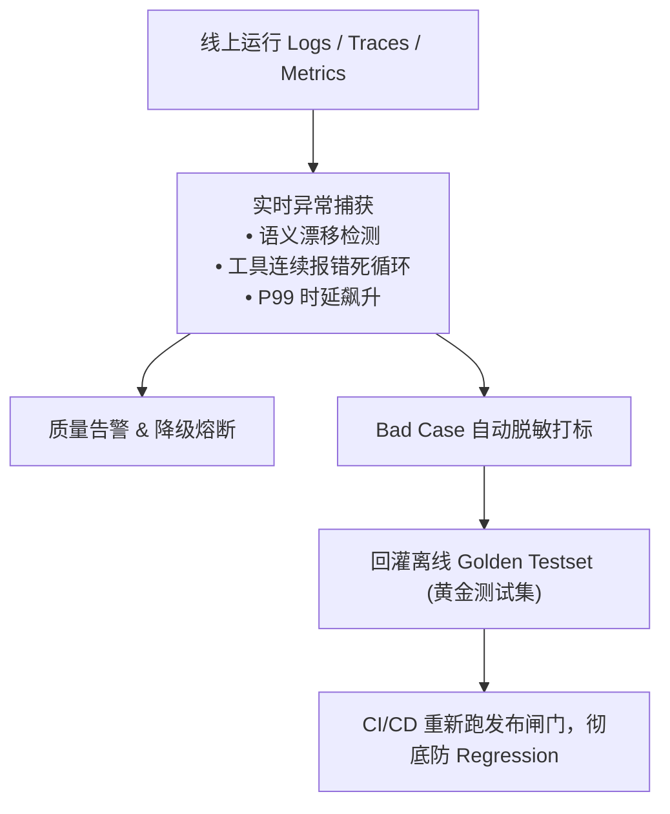

# 06. 发布闸门红线与线上可观测性监控 (Release & Ops)

成本、时延、效率、安全与合规不是上线后才临时关注的指标，而是**横向贯穿上线前“准入门槛”与上线后“持续监控”的一致标尺**。

---

## 1. 上线前 5 大发布闸门（Release Quality Gates）

任何一次模型微调、Prompt 变更或工具更新，都必须全量通过 CI/CD 流水线中的 5 大并列闸门，**任何一项踩红线均一票否决**：

```
┌─────────────────────────────────────────────────────────────┐
│ 🔴 闸门 1：功能质量 ➔ 核心任务基准集端到端成功率 >= 95%      │
├─────────────────────────────────────────────────────────────┤
│ 🔴 闸门 2：轨迹与规划 ➔ 错误工具调用率 = 0%，反思错误率 < 2% │
├─────────────────────────────────────────────────────────────┤
│ 🔴 闸门 3：成本与效率 ➔ 单次任务 Token 消耗在预算内，P95 < 2s│
├─────────────────────────────────────────────────────────────┤
│ 🔴 闸门 4：安全红线 ➔ 越狱防御率 100%，敏感信息泄露率 = 0%   │
├─────────────────────────────────────────────────────────────┤
│ 🔴 闸门 5：业务可用性 ➔ 真实场景人工兜底触发率 < 3%         │
└─────────────────────────────────────────────────────────────┘
```

---

## 2. 线上 A/B 测试与灰度发布

离线评测分数高，不代表真实用户体验好。**A/B 测试是用真实用户流量做出的最终裁决**。

### 灰度放量三部曲：
1. **流量切分**：按用户 ID Hash 划分对照组（Baseline）与实验组（Candidate），先放量 1%，观察稳定后再逐步放量至 10%、50%、100%；
2. **核心业务指标对比**：重点比对用户留存率、订单转化率、会话满意度与投诉率；
3. **自动化熔断回滚**：当线上实验组核心业务指标下滑超过 1.5% 或崩溃率升高时，系统自动执行毫秒级熔断回滚。

---

## 3. 线上可观测性底座与数据飞轮 (Data Flywheel)



### 可观测性三件套：
* **Logs**：记录单次请求的 Prompt、完整模型响应、Guardrail 拦截原因；
* **Traces (如 OpenTelemetry / AgentOps)**：可视化展示单次任务经过了哪些子 Agent 和工具，精准记录每一步的 Token 开销与网络时延；
* **Metrics**：聚合 MTTD（平均故障发现时间）、MTTR（平均故障修复时间）、CFR（变更失败率）。
