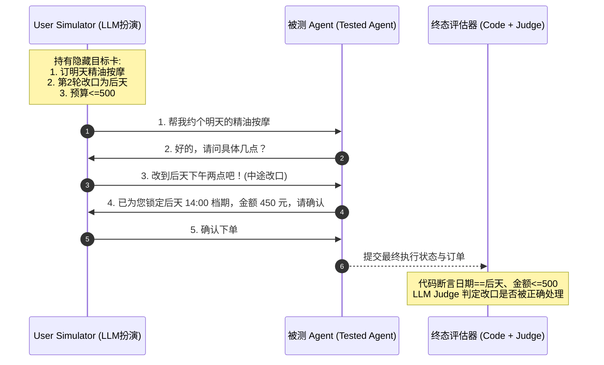

# 06. 系统级集成评测 (System Integration Evaluation)

零件合格不等于整机合格。系统级评测将 Agent 视作端到端闭环实体，检验其在复杂真实环境下的综合表现。

---

## 1. 任务结果评测：Pass@k 与 Pass^k

对于评测任务终态，根据业务目的选择不同严格度：
* **Pass@k**：同一任务独立运行 $k$ 次，只要有 1 次成功即判定通过（用于发掘模型潜力）；
* **Pass^k**：同一任务独立运行 $k$ 次，**必须全部 $k$ 次均成功才判定通过**（美团 VitaBench 采用 $\text{Pass}^4$，衡量工业级稳定性与抗抖动能力）。

---

## 2. 轨迹评测 (Trajectory Evaluation)

一个 Agent 可能“蒙对了”最终答案，但过程多绕了 10 步、调用了多余且昂贵的工具。

### 🧭 轨迹比对 5 档严格度：

| 档位 | 评测规则 | 适用场景 |
| :--- | :--- | :--- |
| **1. 精确匹配 (Exact Match)** | 动作和工具调用序列与标准轨迹完全 100% 一致 | 严苛金融交易、确定性标准流程 |
| **2. 按序匹配 (In-Order Match)** | 关键里程碑动作必须按正确先后顺序出现，允许穿插次要动作 | 正常业务流程（如必须先查库存再扣款） |
| **3. 任意顺序匹配 (Any-Order)** | 关键动作均已执行，无论先后次序 | 独立信息收集阶段 |
| **4. 轨迹精确率与召回率** | 计算执行动作与标准动作的 Precision / Recall | 开放式探索任务 |
| **5. 单一关键工具使用率** | 单独验证高危关键工具（如支付、删除）是否触发 | 安全关键动作审计 |

---

## 3. 多轮对抗评测：User Simulator + 隐藏目标卡

真实用户绝不会按照写死的剧本提问。



---

## 4. 多 Agent 协作评测 (Multi-Agent Team Evaluation)

多 Agent 架构引入了团队协作、交接通信等全新失败面。

```
┌─────────────────────────────────────────────────────────────┐
│ 1. 交接轨迹评测 (Handoff Trace) ➔ 验证 Agent 选派与字段传递完整性│
├─────────────────────────────────────────────────────────────┤
│ 2. 消融评测 (Ablation Study) ➔ 验证新增 Agent 是否具备真实边际收益│
├─────────────────────────────────────────────────────────────┤
│ 3. 过程监控与 Reviewer 质检 ➔ 抓取多 Agent 死循环、推诿与冲突    │
└─────────────────────────────────────────────────────────────┘
```

### 消融实验设计矩阵：
* **Full Team**（全量 Agent 团队）：衡量架构上限；
* **No Router**（去掉路由 Agent）：验证路由分发是否显著降低了工具误调用；
* **Single Agent**（退化为单 Agent 大模型）：对比多 Agent 是否属于“过度设计”，计算每提升 1% 准确率所付出的额外 Token 与时延成本。
