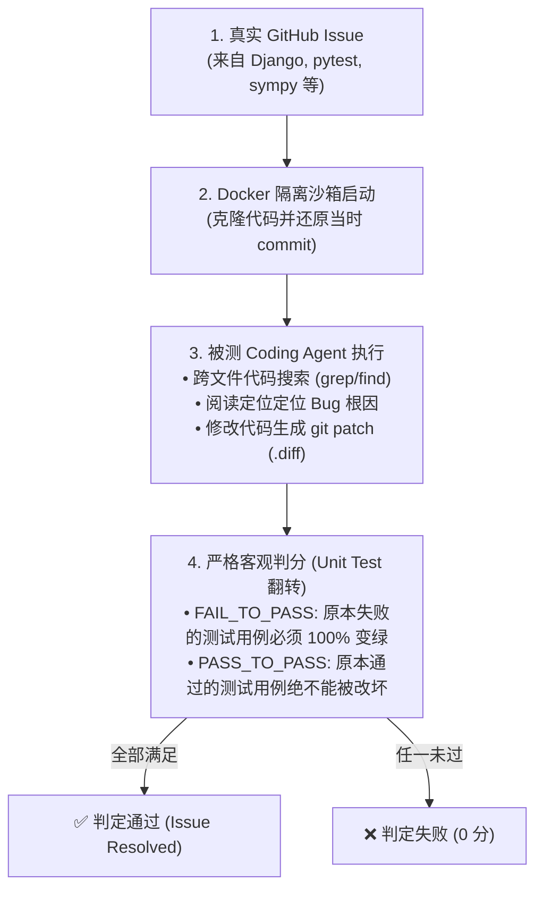
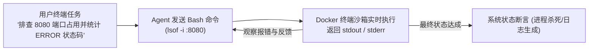

# 07. 工业界前沿实战案例与权威评测基准 (Industry Case Studies & Benchmarks)

本章汇集并深度拆解全球工业界与学术界在 **Agent 评测基准 (SWE-bench / OSWorld / Terminal-Bench / VitaBench / TAU-bench / GAIA)**、**多模态基模架构 (LongCat-Next)** 与 **高效低时延推理架构 (LongCat-Flash)** 领域的顶级实战落地成果。

---

## 💻 案例专题一：SWE-bench (普林斯顿大学 / Cognition / OpenAI)

* 📄 **论文**：[*SWE-bench: Can Language Models Resolve Real-World GitHub Issues? (ICLR 2024)*](https://arxiv.org/abs/2310.06770)
* 🐙 **官方仓库**：[`princeton-nlp/SWE-bench`](https://github.com/princeton-nlp/SWE-bench)
* 🌟 **行业地位**：**AI 软件工程与自主代码 Agent（如 Devin、Claude Code、Cursor）全球公认的唯一“黄金定级赛”！**

```
┌─────────────────────────────────────────────────────────────────────────────┐
│ 🌟 SWE-bench 三大版本矩阵                                                   │
├─────────────────────────────────────────────────────────────────────────────┤
│ 1. SWE-bench Full (2,294 题) ➔ 涵盖 12 个大型 Python 仓库的真实历史 Issue    │
│ 2. SWE-bench Lite (300 题)   ➔ 精简高频子集，用于算法团队高频快速迭代        │
│ 3. SWE-bench Verified (500 题) ➔ OpenAI 人工专家全面清洗去噪后的权威终极榜单 │
└─────────────────────────────────────────────────────────────────────────────┘
```



### 💡 核心评测设计与启发：
1. **彻底杜绝 LLM 裁判的主观偏差**：通过 Docker 沙箱中真实运行 `pytest` 单元测试是否翻转（FAIL $\rightarrow$ PASS）作为客观标准；
2. **长链路文件系统感知**：要求 Agent 具备在数万行代码库中自主导航、多文件编辑与环境配置的能力。

---

## 🖥️ 案例专题二：OSWorld (香港大学 / 普林斯顿 / 滑铁卢大学)

* 📄 **论文**：[*OSWorld: Benchmarking Multimodal Agents for Open-Ended Tasks in Real Computer Operating Systems (NeurIPS 2024)*](https://arxiv.org/abs/2404.07972)
* 🐙 **官方仓库**：[`xlang-ai/OSWorld`](https://github.com/xlang-ai/OSWorld)
* 🌟 **行业地位**：全球首个**全功能真实计算机操作系统（Ubuntu OS）多模态 GUI + CLI 智能体评测基准**。

```
                            ┌──────────────────────────────────────────┐
                            │ 真实 Ubuntu 操作系统虚拟机 / Docker 环境 │
                            └────────────────────┬─────────────────────┘
                                                 │
                   ┌─────────────────────────────┼─────────────────────────────┐
                   ▼                             ▼                             ▼
         [ 办公套件 Office ]             [ 网络与通信 App ]            [ 多媒体与开发工具 ]
         LibreOffice Writer/Calc         Chrome 浏览器 / Thunderbird   VS Code / GIMP / VLC
```

### 💡 核心评测设计与启发：
1. **多模态环境感知与动作空间**：
   * 输入：屏幕截图（Screenshot RGB）+ 操作系统无障碍辅助树（Accessibility Tree / A11y）+ Bash 终端；
   * 输出动作：鼠标移动、左键/右键点击、拖拽（Drag & Drop）、键盘打字、系统快捷键与 Bash 命令。
2. **真实跨应用长链路任务（369 个真实任务）**：
   * 例如：“在 Chrome 中下载销售数据 CSV，用 LibreOffice Calc 绘制柱状图，保存为 PDF 并通过 Thunderbird 邮件发送给经理”。
3. **确定性底层状态校验器（State Evaluator）**：
   * 任务结束后，评测引擎直接读取系统底层的 SQLite 数据库、文件系统 MD5、配置文件与进程状态进行严格断言。

---

## ⌨️ 案例专题三：Terminal-Bench / InterCode (命令行与终端 Agent 基准)

* 📄 **代表基准**：[`princeton-nlp/intercode`](https://github.com/princeton-nlp/intercode) / **Terminal-Bench** (普林斯顿 / UC 伯克利)
* 🌟 **行业地位**：评估 Agent 在 **Linux 命令行终端（Bash / Shell）** 环境下自主运维、网络排错与系统管理的标准基准。



### 💡 核心评测设计：
1. **多轮执行反馈回路 (Execution Feedback Loop)**：Agent 敲入命令后获得实时的终端输出（包括语法错误、权限不足、管道符报错），评测 Agent 是否能根据 `stderr` 进行**自我纠错（Self-Correction）**；
2. **覆盖完整 DevOps / SRE 场景**：涵盖文件正则过滤（`grep`/`sed`/`awk`）、进程与端口管理（`ps`/`netstat`/`kill`）、包管理器（`apt`/`pip`）、网络调试（`curl`/`tcpdump`）与 Git 版本控制。

---

## 🐱 案例专题四：美团龙猫 (Meituan LongCat) 全景前沿体系

美团龙猫团队（Meituan LongCat）在智能体交互评测、端到端原生多模态以及高并发轻量化推理等方向取得了突破性成果：

### 1. 美团 VitaBench：生活服务复杂交互评测基准
* 📄 **核心定位**：解决学术 Benchmark 过于“玩具化”的痛点，构建首个贴近真实复杂生活场景的 Agent 交互与决策评测环境。
* 🍽️ **核心场景**：外卖点餐、餐厅到店、酒旅出行三大高复杂度生活服务。
* **三维 POMDP 复杂度建模**：
  * **推理复杂度**：百余商品候选、多步长链路约束满足；
  * **工具复杂度**：66 个真实业务工具与 512 条前置依赖边的稠密工具图；
  * **交互复杂度**：引入 GPT-4.1 动态用户模拟器，模拟模糊表达与中途改口。
* **$\text{Pass}^4$ 严苛度压测**：在 Temperature=0 下同一任务连续跑 4 次，4 次全对才算通过。
* **关键实验结论**：即便是顶尖推理模型 $\text{Pass}^4 \approx 0$；失败主因中“推理与规划错误”占 61.8%。

### 2. LongCat-Next: Lexicalizing Modalities as Discrete Tokens
* 📄 **论文**：[*LongCat-Next: Lexicalizing Modalities as Discrete Tokens (arXiv:2603.27538)*](https://arxiv.org/pdf/2603.27538)
* 🐙 **开源仓库**：[`meituan-longcat/LongCat-Next`](https://github.com/meituan-longcat/LongCat-Next)
* **核心创新点**：将视觉与音频模态**彻底离散化（Quantization）为统一字典中的离散 Token**，实现全模态端到端原生自回归自监督统一建模。

### 3. LongCat-Flash Technical Report: 高并发低延迟架构
* 📄 **技术报告**：[*LongCat-Flash Technical Report (arXiv:2509.01322)*](https://arxiv.org/abs/2509.01322)
* **核心优化**：针对超高 QPS 业务场景，采用 MoE 稀疏路由与长上下文 KV 压缩，单次推理吞吐提升 3~5 倍，单 Token 成本降低 70%+。

---

## 🏛️ 案例专题五：TAU-bench (Sierra / 斯坦福大学)

* 📄 **论文 & 仓库**：[`sierra-research/tau-bench`](https://github.com/sierra-research/tau-bench)
* **核心场景**：航空公司退改签、电商退货退款等带真实数据库约束的智能客服场景。
* **突破性评测设计**：
  * **数据库事务一致性检查 (DB State Verification)**：在沙箱数据库中真实执行 SQL/API，任务结束后比对数据库状态（防非法改价、防超额退款）；
  * **用户模拟器动态博弈**：模拟真实用户维权、提供错误单号、提出苛刻要求，评测 Agent 防越权边界。

---

## 🌍 案例专题六：GAIA (Meta / AutoGPT / HuggingFace)

* 📄 **基准地址**：[GAIA Benchmark Leaderboard](https://huggingface.co/spaces/gaia-benchmark/leaderboard)
* **核心场景**：通用个人 AI 助手（General AI Assistants）多模态、多步骤长任务处理。
* **突破性评测设计**：
  * **人类极其容易、AI 极难（反向图灵测试设计）**：人类通过率 92%，AI 需自主串联浏览器搜索、多页 PDF/Excel 计算、Python 代码生成与多模态图表识别。
