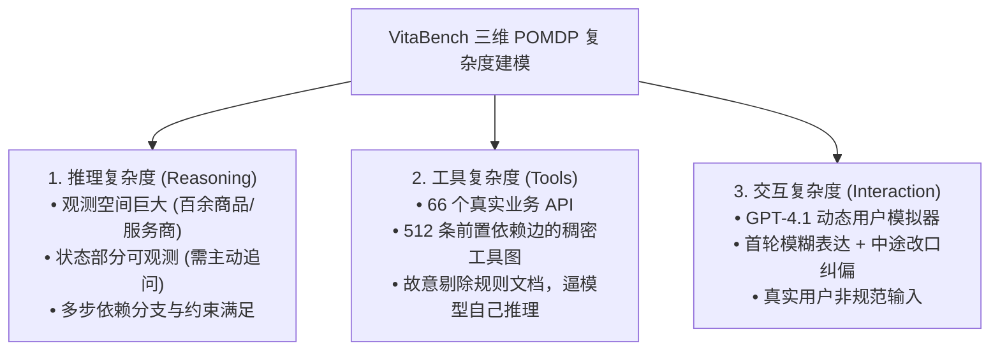

# 07. 工业界前沿实战案例与前沿研究 (Industry Case Studies)

本章汇集并深度拆解工业界在 **Agent 评测基准 (VitaBench)**、**多模态基模架构 (LongCat-Next)** 与 **高效低时延推理架构 (LongCat-Flash)** 领域的顶级实战落地成果。

---

## 🐱 案例专题：美团龙猫 (Meituan LongCat) 全景前沿体系

美团龙猫团队（Meituan LongCat）在智能体交互评测、端到端原生多模态以及高并发轻量化推理等方向取得了突破性成果：

```
┌─────────────────────────────────────────────────────────────────────────────┐
│ 🌟 美团龙猫 (Meituan LongCat) 三大核心技术成果布局                          │
├─────────────────────────────────────────────────────────────────────────────┤
│ 1. VitaBench 评测基准 ➔ 复杂生活服务环境 POMDP 三维建模 (外卖/餐饮/出行)   │
│ 2. LongCat-Next 架构  ➔ 统一多模态离散 Token 化 (Lexicalizing Modalities)   │
│ 3. LongCat-Flash 报告 ➔ 高并发在线服务极致低时延与 MoE 架构优化             │
└─────────────────────────────────────────────────────────────────────────────┘
```

---

### 一、 美团 VitaBench：生活服务复杂交互评测基准

* 📄 **核心定位**：解决学术 Benchmark 过于“玩具化”的痛点，构建首个贴近真实复杂生活场景的 Agent 交互与决策评测环境。
* 🍽️ **核心场景**：美团核心业务三件套（外卖点餐、餐厅到店、酒旅出行）。



#### 📊 核心评测机制与指标：
* **$\text{Pass}^4$ 严苛度压测**：在 Temperature=0 下，同一个复杂任务连续运行 4 次，**4 次必须全部成功才计入通过**（Avg@4 / Pass@4 / $\text{Pass}^4$）；
* **核心实验结论**：
  * 即便是当时顶尖的模型 o3，在真实场景下的 $\text{Pass}^4 \approx 0$，抗长链路干扰能力薄弱；
  * **失败主因中“推理与规划错误”占 61.8%**，证明单纯优化单次 Tool Calling 格式无法解决端到端业务闭环问题。

---

### 二、 LongCat-Next: Lexicalizing Modalities as Discrete Tokens

* 📄 **论文**：[*LongCat-Next: Lexicalizing Modalities as Discrete Tokens (arXiv:2603.27538)*](https://arxiv.org/pdf/2603.27538)
* 🐙 **开源仓库**：[`meituan-longcat/LongCat-Next`](https://github.com/meituan-longcat/LongCat-Next)

```
                            ┌──────────────────────────────────────────┐
                            │ 统一词表空间 (Unified Vocabulary)        │
                            │ [ Text Tokens | Vision Tokens | Audio ]  │
                            └────────────────────┬─────────────────────┘
                                                 │
                   ┌─────────────────────────────┼─────────────────────────────┐
                   ▼                             ▼                             ▼
         [ 文本分词编码 ]               [ 视觉离散 Token 化 ]         [ 语音离散 Token 化 ]
         BPE Text Tokenizer            Vision Codebook / VQ-VAE      Continuous-to-Discrete
```

#### 💡 核心设计与创新突破：
1. **原生统一离散词表 (Lexicalized Discrete Tokens)**：
   * 摒弃传统的“连续特征投影（Continuous Feature Projector）”架构（如 CLIP / MLP 线性投影层）；
   * 将**视觉（Vision）、音频（Audio）等非文本模态彻底离散化（Quantization）为统一字典中的离散 Token**；
2. **端到端原生自回归统一生成**：
   * 模型像生成自然语言文本一样原生“生成图像 Token”和“生成语音 Token”，实现真正的全模态统一自回归建模；
3. **极大幅度降低多模态 Agent 评测与对齐难度**：
   * 离散化后，多模态输出可直接复用文本级 Exact Match、F1 Score 与 Token-Level 语义相似度度量体系。

---

### 三、 LongCat-Flash Technical Report: 高并发低延迟架构

* 📄 **技术报告**：[*LongCat-Flash Technical Report (arXiv:2509.01322)*](https://arxiv.org/abs/2509.01322)

#### 🚀 核心工程与性能优化：
1. **极致首字时延（TTFT）与每字时延（TPOT）优化**：
   * 针对美团外卖实时客服与推荐搜索的高并发（QPS 破万）场景，采用混合专家（MoE）路由与深度剪枝架构；
2. **KV Cache 显存极致压缩与长上下文流式传输**：
   * 结合 GQA（Grouped Query Attention）与高效稀疏注意力机制，在维持长多轮会话记忆的同时，大幅削减显存占用；
3. **与线上 A/B 评测闸门的深度绑定**：
   * 在维持高准确率的前提下，单次推理吞吐量提升 3~5 倍，单 Token 成本降低 70%+。

---

## 🛠️ 其他工业界前沿基准概览

| 基准名称 | 主导机构 / 开源地址 | 核心评测能力与维度 |
| :--- | :--- | :--- |
| **BFCL** | [Berkeley Function-Calling Leaderboard](https://gorilla.cs.berkeley.edu/leaderboard.html) | 原生单工具、多工具、并行并发工具调用准确率与沙箱真机执行验证 |
| **SWE-bench** | [princeton-nlp/SWE-bench](https://github.com/princeton-nlp/SWE-bench) | 基于 Docker 沙箱验证 Agent 自主修复真实 GitHub Issue 并通过单元测试的能力 |
| **GAIA** | [General AI Assistants Benchmark](https://huggingface.co/spaces/gaia-benchmark/leaderboard) | 评估通用助手的多模态、复杂网络检索与多步骤文件处理能力 |
