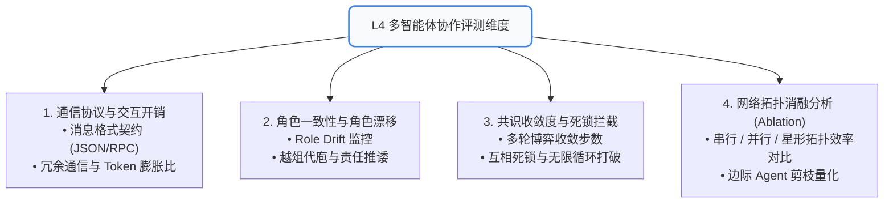

# 07. L4 多智能体协作评测：协议治理、角色漂移、死锁拦截与拓扑消融

随着单智能体复杂度见顶，工业界广泛采用 **多智能体协作系统 (Multi-Agent System, MAS)**（如 MetaGPT、ChatDev、AutoGen、CrewAI）。
多 Agent 协作虽然提升了专业分工能力，但也引入了**指数级爆炸的通信开销、角色混淆、互相踢皮球与死锁死循环**。本章深入多 Agent 评测专属体系。

---

## 🧭 一、 L4 多智能体协作评测全景图



---

## 📡 二、 通信协议治理与 Token 膨胀比 (Communication Efficiency)

在多 Agent 系统中，Agent 之间对话的成本往往比解决问题本身的成本高出数倍。

### 📊 核心度量指标：
1. **通信 Token 膨胀比 (Communication Inflation Ratio)**：
   $$	ext{Inflation Ratio} = rac{	ext{Agent 间通信消耗的 Token 总量}}{	ext{最终交付成果实际需要的 Token 数量}}$$
   * 若比值超过 $5.0$，说明多 Agent 之间存在大量的寒暄废话与信息冗余。
2. **信息衰减度 (Information Decay)**：
   * 用户在 Agent A 提出的约束（“只要中餐”），经过 Agent B 转发给 Agent C 时，是否发生关键条件丢失。

---

## 🎭 三、 角色一致性与角色漂移评测 (Role Consistency & Role Drift)

每个 Agent 在系统中都有专属职责（如 PM Agent 负责出 PRD、Coder Agent 负责写代码、Reviewer Agent 负责提意见）。

### 🚨 2 类典型多 Agent 协作灾难：
1. **角色漂移 (Role Drift)**：
   * 随着多轮上下文增长，Reviewer Agent 突然开始自己重写代码，或者 Coder Agent 擅自修改产品需求；
   * **断言方式**：基于角色行为白名单，检测每个 Agent 发出的 Action 是否属于其权限范围。
2. **责任推诿与踢皮球 (Ping-Pong Loop)**：
   * Agent A：“请 Agent B 确认”，Agent B：“请 Agent A 先修改”，两方陷入无休止的礼貌扯皮。

---

## 🤝 四、 协作共识收敛度与死锁拦截 (Consensus & Deadlock Detection)

在辩论（Debate）或审查机制中，多个 Agent 最终需要就某个决策达成一致。

* **收敛步数 (Rounds to Consensus)**：系统达成共识所需的平均轮数。健康系统通常在 2~3 轮内收敛，若超过 6 轮仍未达成一致，必须强行由 Arbiter（仲裁 Agent）介入兜底；
* **分布式死锁检测**：
  * 构建 Agent 依赖有向图 $G = (V, E)$；
  * 若存在环路依赖且超过 $T$ 秒无有效状态跃迁，触发全局超时中断。

---

## 🔬 五、 协作网络拓扑消融实验 (Multi-Agent Ablation Study)

> **“不要为了多 Agent 而多 Agent。”**

引入额外的 Agent 会增加故障点与调用成本。必须通过消融实验验证每个 Agent 的“净贡献”：

```
拓扑 A (串行链式): User ➔ PM Agent ➔ Coder Agent ➔ Tester Agent ➔ Output
拓扑 B (星形中枢): User ➔ Coordinator Agent ➔ (并行调度 PM / Coder / Tester)
拓扑 C (单体 Agent): User ➔ All-in-one Single Agent ➔ Output
```

### 📊 拓扑消融 ROI 评估矩阵：
* **有效增益 (Net Benefit)**：相比单体 Agent，多 Agent 拓扑在复杂用例上的任务成功率提升幅度 $\Delta 	ext{Success Rate}$；
* **成本弹性比 (Cost Elasticity)**：为了获得 $10\%$ 的成功率提升，是否付出了 $300\%$ 的 Token 与时延成本？
* **结论输出**：剪枝掉产出极低但频繁引发死锁的冗余 Agent 节点。
