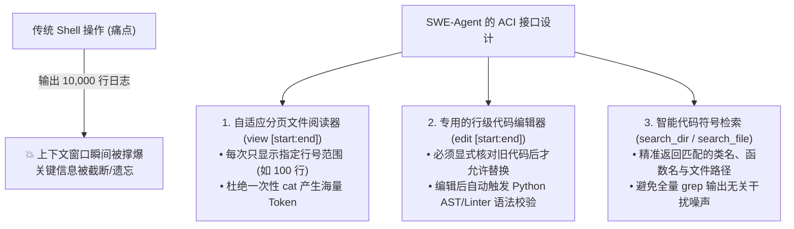
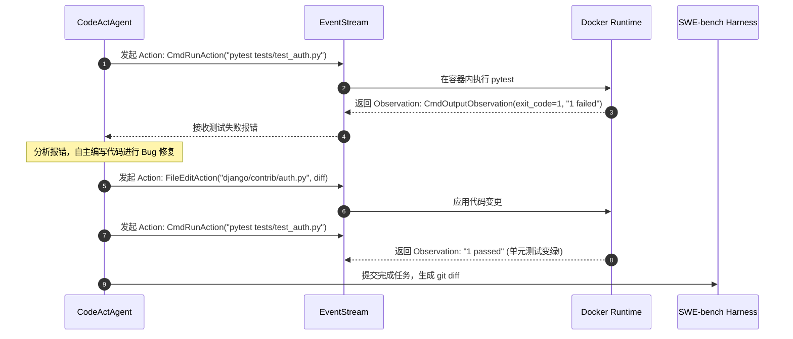

# 08. OpenHands 与 SWE-Agent：自主编程智能体架构设计、ACI 接口与 SWE-bench 评测实战

在以 **SWE-bench** 为代表的复杂软件工程评测中，仅靠简单的“对话式大模型”远远无法解决实际代码仓库中的 Bug。业界诞生了以 **OpenHands (原 OpenDevin)** 和 **SWE-Agent** 为代表的顶级自主编程智能体（Autonomous Software Engineering Agents）。

本章深入拆解它们的**核心架构、智能体-计算机接口 (ACI) 设计理念、评测运行机制以及在 SWE-bench 上的实战表现**。

---

## 🌟 一、 OpenHands vs SWE-Agent 核心架构对比矩阵

| 对比维度 | OpenHands (原 OpenDevin / All-Hands AI) | SWE-Agent (普林斯顿大学 Princeton NLP) |
| :--- | :--- | :--- |
| **官方仓库** | [All-Hands-AI/OpenHands](https://github.com/All-Hands-AI/OpenHands) | [princeton-nlp/SWE-agent](https://github.com/princeton-nlp/SWE-agent) |
| **核心设计理念** | **模块化多智能体 + EventStream 事件流 + CodeAct 模式** | **专门为大模型定制的“智能体-计算机接口 (ACI)”** |
| **核心执行模式** | **CodeAct**：直接在 Bash 中编写和执行 Python 代码片段（将 Python 代码作为统一的动作空间） | **专用工具集合**：定制经过高度裁剪的分页查看器、行级编辑器与目录检索工具 |
| **运行沙箱环境** | Docker 容器、远程 SSH、Kubernetes Pod 集群 | 隔离的 Docker 容器环境 |
| **能力覆盖范围** | 全栈软件开发、网页浏览交互、命令行运维、自动化测试 | 专注大型代码库 Bug 修复与 Issue 解决 |
| **SWE-bench 战绩** | 开源自主 Coding Agent 顶尖梯队（SWE-bench Verified 解决率 > 53%） | 首个将 ACI 接口系统化并开源的学术界标杆框架 |

---

## 🛠️ 二、 SWE-Agent 的核心突破：智能体-计算机接口 (ACI) 设计

普林斯顿团队在开发 SWE-Agent 时提出了一个颠覆性观点：

> **“大模型在软件工程中的瓶颈，往往不是模型推理能力不够，而是给模型提供的操作接口（ACI）太难用、太容易把上下文撑爆！”**



### SWE-Agent 评测运行生命周期：
1. **环境准备**：拉取 Issue 对应仓库并启动 Docker 沙箱；
2. **自主探索与复现**：Agent 调用 `search_dir` 和 `view` 定位可疑文件，并在沙箱中编写复现脚本（Reproduction Script）；
3. **精准编辑与单测验证**：使用 `edit` 工具修改代码，在沙箱运行测试验证；
4. **提交 Patch**：执行 `git diff` 生成标准补丁文件（`.patch`），交由 SWE-bench 评测引擎做终态判定。

---

## ⚡ 三、 OpenHands (OpenDevin) 架构：EventStream 与 CodeAct

OpenHands 采用了高度工业化的 **EventStream（事件流驱动）架构**：

```
┌─────────────────────────────────────────────────────────────────────────────┐
│ 1. EventStream (核心消息中枢)                                               │
│    • Action Events (Agent 发起的动作: 执行命令、读写文件、浏览网页、思考)   │
│    • Observation Events (环境反馈的观察: 命令输出、文件内容、DOM 树、报错) │
├─────────────────────────────────────────────────────────────────────────────┤
│ 2. CodeActAgent (核心智能体大脑)                                            │
│    • 将 Python 代码解释器作为通用的 Action 空间 (直接生成并执行 Python 代码)│
│    • 相比传统 JSON-based Tool Calling，支持更复杂的循环、临时变量与数据转换 │
├─────────────────────────────────────────────────────────────────────────────┤
│ 3. Runtime Sandbox (多后端沙箱运行时)                                      │
│    • Docker Runtime / Remote SSH Runtime / Modal Cloud                      │
└─────────────────────────────────────────────────────────────────────────────┘
```



---

## 📊 四、 在 SWE-bench 上的实战评测运行流程

如果你想用 OpenHands 或 SWE-Agent 在 SWE-bench 上跑评测，标准执行流水线如下：

```bash
# 1. 安装 SWE-bench 评测套件
pip install swebench

# 2. 运行 SWE-Agent 针对 SWE-bench Lite 生成预测 Patch
python run.py \
  --model_name "gpt-4o" \
  --data_path "princeton-nlp/SWE-bench_Lite" \
  --config_file "config/default.yaml" \
  --output_dir "eval_outputs/swe_agent_lite"

# 3. 运行 SWE-bench 官方 Harness 进行客观单测翻转判分
python -m swebench.harness.run_evaluation \
  --dataset_name "princeton-nlp/SWE-bench_Lite" \
  --predictions_path "eval_outputs/swe_agent_lite/all_preds.jsonl" \
  --max_workers 4 \
  --run_id "swe_agent_eval_run"
```

---

### 💡 核心启示（测试开发与架构视角）：
1. **Agent 的本质是“沙箱中的状态机”**：评测的不是模型说了什么漂亮话，而是看它能否在隔离的 Docker 容器中把 `pytest` 从红灯调成绿灯；
2. **ACI（交互接口）的工程打磨至关重要**：良好的分页查看、行级编辑与语法护栏，能够直接将 Agent 的有效任务完成率提升 15%~30%！
