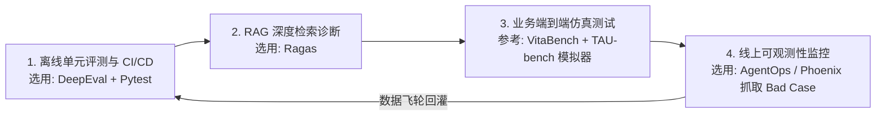

# 09. 全球前沿 Agent 评测工具、框架与生态雷达 (Ecosystem Radar)

为了让 **Awesome Agent Eval** 成为业界最权威的参考体系，本章系统梳理了全球工业界与学术界顶级机构（Stanford、Berkeley、Princeton、Meta、美团、Confident AI 等）开源的 **16 大核心评测工具、框架与平台**，并提供选型对比矩阵。

---

## 🧭 全球 Agent 评测工具生态分类全景

```
┌─────────────────────────────────────────────────────────────────────────────┐
│ 1. 自动化评测流水线与单元断言库 (Testing & Eval Frameworks)                  │
│    • DeepEval, Ragas, Promptfoo, OpenAI Evals, Inspect AI, DSPy             │
├─────────────────────────────────────────────────────────────────────────────┤
│ 2. 真实交互环境基准 (Interactive Agent Benchmarks)                          │
│    • VitaBench (美团), SWE-bench (普林斯顿), GAIA (Meta), WebArena (CMU)    │
│    • OSWorld (港大), TAU-bench (Sierra/斯坦福), BFCL (伯克利), ToolBench    │
├─────────────────────────────────────────────────────────────────────────────┤
│ 3. 线上可观测性与实时评测平台 (LLM/Agent Observability & Tracing)           │
│    • AgentOps, Arize Phoenix, LangSmith, Trulens                            │
└─────────────────────────────────────────────────────────────────────────────┘
```

---

## 🛠️ 第一部分：顶尖自动化评测框架与工具库

| 工具名称 | 主导机构 / 开源地址 | 核心定位与适用场景 | 核心评测指标与武器 |
| :--- | :--- | :--- | :--- |
| **DeepEval** | [confident-ai/deepeval](https://github.com/confident-ai/deepeval) | 生产级 LLM/Agent 单元测试与 CI/CD 流水线框架（Python 测开首选） | G-Eval (自定义 Rubric)、Tool Calling 召回率、幻觉检测、RAG 忠实度 |
| **Ragas** | [explodinggradients/ragas](https://github.com/explodinggradients/ragas) | 专注 RAG 与多智能体全链路评估的行业标准库 | Context Precision/Recall、Faithfulness、Multi-Agent 通信评估 |
| **Promptfoo** | [promptfoo/promptfoo](https://github.com/promptfoo/promptfoo) | 轻量 CLI 工具，主打超高速 Prompt 变体对比与红队安全渗透测试 | 提示词注入攻击防御率、红队漏洞扫描、JSON 结构化校验、多模型横评 |
| **Inspect AI** | [UK-AI-Safety-Institute/inspect_ai](https://github.com/UK-AI-Safety-Institute/inspect_ai) | 英国人工智能安全研究所出品的政府/企业级 Agent 能力与安全评估框架 | 沙箱代码执行安全、多步长规划能力、密码学与网络安全攻防评测 |
| **DSPy** | [stanfordnlp/dspy](https://github.com/stanfordnlp/dspy) | 斯坦福大学出品，将“调 Prompt”转化为“编译与优化程序”的革命性框架 | 自动化 Metric 驱动的 Prompt 自动调优（Teleprompter / Assertions） |
| **OpenAI Evals** | [openai/evals](https://github.com/openai/evals) | OpenAI 官方开源的模型与智能体评测框架 | 模型对齐评估、思维链（CoT）推理判定、多选与自由生成评估 |

---

## 🏆 第二部分：全球顶尖 Agent 评测基准 (Benchmarks)

| 基准名称 | 主导机构 / 开源地址 | 评测场景与环境 | 为什么权威？（核心评测设计） |
| :--- | :--- | :--- | :--- |
| **VitaBench** | [meituan-longcat](https://github.com/meituan-longcat) (美团) | 外卖点餐、到店餐饮、酒旅出行三大复杂生活服务 | **POMDP 三维复杂度建模**、66 工具与 512 依赖边、$\text{Pass}^4$ 严苛抗抖动压测 |
| **SWE-bench** | [princeton-nlp/SWE-bench](https://github.com/princeton-nlp/SWE-bench) | 真实 GitHub 开源仓库 Bug 修复 (Software Engineering) | 包含 2,294 个真实 Issue，**以真实 Docker 沙箱中跑 Unit Test 是否通过为唯一黄金标准** |
| **GAIA** | [gaia-benchmark](https://huggingface.co/spaces/gaia-benchmark/leaderboard) (Meta / AutoGPT / HF) | 通用多模态多步骤复杂个人助理任务 | 题目设计对人类极其简单（人类成功率 92%），对 Agent 极具挑战（多模态、网页检索、复杂 Excel/PDF 处理） |
| **BFCL** | [Gorilla-LLM/BFCL](https://gorilla.cs.berkeley.edu/leaderboard.html) (UC 伯克利) | 原生 Tool Calling / Function Calling 权威排行榜 | 涵盖单工具、多工具、并行调用、多语言（Java/Python/REST）与沙箱真实执行 |
| **TAU-bench** | [sierra-research/tau-bench](https://github.com/sierra-research/tau-bench) (Sierra / 斯坦福) | 真实电商与航空公司客服动态会话基准 | 引入 **环境状态数据库事务回滚** 与动态用户模拟器，精准评估 Agent 是否超额退款或破坏数据约束 |
| **WebArena** | [web-arena-x/webarena](https://github.com/web-arena-x/webarena) (CMU) | 动态真实网站端到端操作 (电商/论坛/GitLab/地图) | 真实浏览器操作（点击、输入、导航），以最终网页 DOM 状态与服务器数据库状态变化判分 |
| **OSWorld** | [xlang-ai/OSWorld](https://github.com/xlang-ai/OSWorld) (港大 / 普林斯顿) | 真实计算机操作系统 (Ubuntu GUI / CLI / Office) | 跨应用综合操作（如修改 Excel 图表后发送邮件），以 OS 最终系统文件与状态判定通过 |
| **ToolBench** | [OpenBMB/ToolBench](https://github.com/OpenBMB/ToolBench) (清华大学) | 超大规模真实 API 调度与组合 | 收录了 **16,000+ 个真实世界 RESTful API**，构建海量工具交互决策图谱 |

---

## 📡 第三部分：线上可观测性与实时 Tracing 平台

| 平台名称 | 开源 / 商业形态 | 核心功能 |
| :--- | :--- | :--- |
| **AgentOps** | [AgentOps-AI/agentops](https://github.com/AgentOps-AI/agentops) | 专为 Agent 设计的调用链追踪（可视化多 Agent 编排、死循环检测、Token 费用与耗时拆解） |
| **Phoenix** | [Arize-AI/phoenix](https://github.com/Arize-AI/phoenix) | 完全开源的 LLM/RAG 可观测性平台，支持检索切片可视化、Umap 语义漂移聚类分析 |
| **LangSmith** | [LangChain LangSmith](https://smith.langchain.com/) | 工业界最成熟的 Trace 监控、离线标注与数据集回灌流水线平台 |
| **TruLens** | [truera/trulens](https://github.com/truera/trulens) | 基于 RAG Triad（三元组：上下文相关性、接地忠实度、回答相关性）的实时评测框架 |

---

## 🎯 工业界测试开发团队的最佳选型落地路径


