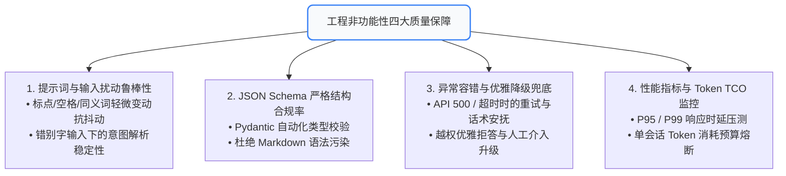

# 09. 工程非功能质量评测：扰动鲁棒性、Schema 合规、API 500 降级与成本时延

在工业级生产上线前，除了功能性指标（成功率、准确率）之外，工程团队面临最多线上故障往往来自**非功能性质量（Non-Functional Requirements, NFR）**。
一次网络抖动、一次格式解析失败、或口语化轻微错别字，绝不能导致 Agent 整个服务不可用。

---

## 🧭 一、 工程非功能性四大质量矩阵



---

## 🛡️ 二、 输入扰动鲁棒性评测 (Perturbation Testing)

用户在前端界面的输入是充满噪音的。评测引擎必须对黄金测试集自动化注入扰动：

### 1. 常见 3 类扰动注入方式：
* **格式扰动**：连续空格、首尾空格、中英文标点混用（`，` vs `,`、`。` vs `.`）；
* **同义词与语序扰动**：“帮我预订一张明天去北京的高铁票” ➔ “明天去北京的火车票帮我买一下”；
* **轻微错别字扰动**：“订机标”、“查天汽”、“买火车标”。

### 2. 评测判定标准：
* **语义解析一致率 (Consistency Rate)** 必须 $\ge 98\%$；
* **工具选择一致率** 必须达到 $100\%$（不得因为错别字而误调其他工具或拒绝调用）。

---

## 📐 三、 JSON Schema 100% 结构合规率

Agent 的输出往往需要对接下游系统的微服务。若大模型偶尔输出了非法的 JSON（例如漏了闭合括号、混入 Markdown ````json 标记），将直接引发下游系统反序列化崩溃。

### 📋 检验维度：
1. **纯净度校验**：输出是否直接为合法 JSON，严禁夹带废话或 Markdown 代码块；
2. **Schema 严格对齐**：使用 Pydantic 或 JSON Schema Validator 进行类型断言（数值不得传成字符串，枚举值不得越界）；
3. **合格线**：在 CI 门禁中，**JSON 结构合规率必须达到 100%**。

---

## 🚨 四、 异常兜底与优雅降级评测 (Exception Fallback Guardrails)

外部依赖（第三方天气 API、数据库、支付网关）总会故障。测试开发必须主动进行**故障注入测试 (Fault Injection)**：

| 注入异常场景 | 错误行为 (Fail) | 正确的优雅降级行为 (Pass) |
| :--- | :--- | :--- |
| **API 返回 500 内部服务错误** | Agent 直接在对话框中喷出原始堆栈报错信息 | 自动触发重试；重试 2 次仍失败后，以安抚话术告知用户稍后再试，并记录告警 |
| **API 响应超时 (Timeout > 5s)** | 页面卡死无响应，耗尽前端连接池 | 触发超时熔断，降级为轻量快速回复或告知“正在后台为您查询” |
| **越权/敏感违规输入** | 盲目执行越权 SQL 查询或泄露系统提示词 | 触发防御守门员 (Guardrail)，礼貌优雅拒答并打标风控日志 |

---

## ⏱️ 五、 性能延迟分布与 Token 成本监控 (Latency & TCO)

* **时延度量**：记录首字延迟 (TTFT) 与端到端耗时 (End-to-End Latency)。Agent 往往伴随多次模型往返与工具调用，端到端 P99 必须控制在业务可承受的阈值（如 < 8s）内；
* **单任务 Token 消耗监控**：监控每个任务的 Prompt Tokens 与 Completion Tokens，防止因未收敛的 ReAct 循环导致单次会话消耗数十万 Token。

### 💻 实战代码：
运行项目中提供的工程非功能性测试脚本：
```bash
python evals/robustness_and_fallback_demo.py
```
