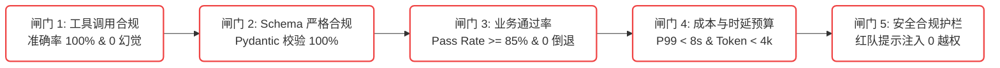
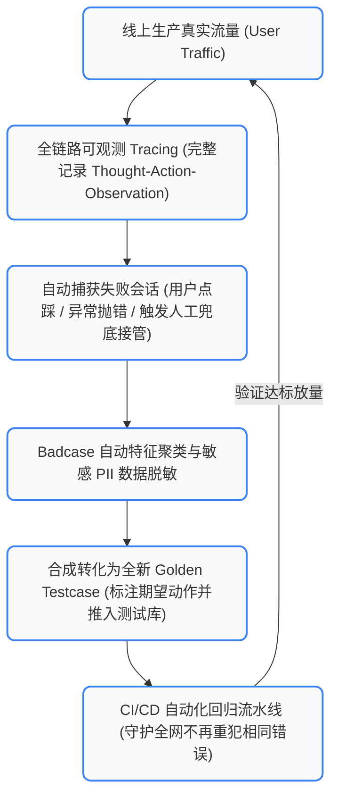

# 12. 生产发布闸门、评测平台架构与数据飞轮闭环 (含 25 个工业避坑 FAQ)

评测不是为了写出漂亮的报告，而是为了**守护生产质量底线**，并构建**持续自我进化的闭环飞轮**。
本章系统阐述企业级 Agent 上线前的 **5 大发布红线**、**企业评测中台 5 层标准架构**、**数据飞轮流转机制** 以及 **25 个高频避坑 FAQ**。

---

## 🛡️ 一、 上线前 5 大发布闸门红线 (Production Release Gates)

在 CI/CD 流水线中，任何一次 Prompt 调整或模型微调，只有全部越过以下 **5 大发布闸门**，才允许合并代码与放量：



### 📋 5 大闸门量化通过标准：
1. **工具调用合规门禁**：测试集所有工具调用准确率必须 $100\%$，且在负向反例中工具调用率必须为 $0\%$；
2. **结构合规门禁**：JSON Schema / Pydantic 解析成功率必须达到 $100\%$，任何格式解析异常均直接阻断构建；
3. **核心业务通过率**：端到端用例 Pass Rate 必须 $\ge 85\%$，且核心高优先级黄金用例（P0）**0 负向回退（Zero Regression）**；
4. **性能与预算门禁**：端到端 P99 响应时延不得劣于基线版本的 $110\%$，单次会话平均 Token 消耗不得超标；
5. **安全与鲁棒性门禁**：红队越狱注入（Jailbreak）与 Prompt 注入测试拦截率必须达到 $100\%$。

---

## 🏛️ 二、 企业级评测平台 5 层标准架构

一个可供百人研发团队共享的评测中台，应按照以下 5 层清晰解耦：

```
┌─────────────────────────────────────────────────────────────────────────────┐
│ 1. 业务接入层 (UI / CLI / IDE 插件 / CI/CD Webhook / OpenAPI 网关)          │
├─────────────────────────────────────────────────────────────────────────────┤
│ 2. 执行调度层 (Celery / Ray 分布式任务分发, 并发控制, 依赖拓扑编排)        │
├─────────────────────────────────────────────────────────────────────────────┤
│ 3. 隔离沙箱环境层 (Docker 沙箱池, K8s Job, Mock API 动态网关, 数据库回滚)  │
├─────────────────────────────────────────────────────────────────────────────┤
│ 4. 指标计算与裁判层 (确定性断言引擎, NLP 度量库, 双盲 LLM Judge, G-Eval)    │
├─────────────────────────────────────────────────────────────────────────────┤
│ 5. 可观测与看板层 (Diff 对比看板, 轨迹播放器, Badcase 聚类, 数据飞轮导出)  │
└─────────────────────────────────────────────────────────────────────────────┘
```

---

## 🔄 三、 生产数据飞轮与自进化闭环 (Data Flywheel)

评测集绝不能是静态死水。优秀团队的测试集在上线第 90 天时，规模通常会扩充 3~5 倍：



---

## 💡 四、 工业级核心疑难解答与避坑指南 (25 问精粹)

### 模块一：认知与方法论
1. **Q: 智能体评测与传统软件测试核心区别？**
   * **A**: 传统测试是确定性断言，Agent 测试面对概率性输出。必须采用状态翻转断言、轨迹过程比对与双盲裁判。
2. **Q: 什么是 EDD（评估驱动开发）？**
   * **A**: 类比 TDD。在写 Agent 之前先定量规、构建黄金测试集与评测沙箱，一切迭代以回归指标提升为准绳。
3. **Q: 为什么只看最终回答会导致灾难？**
   * **A**: Agent 可能会靠运气蒙对最终答案，但中途调用了高风险工具、消耗了数万 Token 或产生了违规副作用。

### 模块二：组件与工程质量
4. **Q: 如何科学评估 RAG 系统？**
   * **A**: 严格解耦检索段与生成段。检索段测 Context Precision/Recall 和 NDCG，生成段测 Faithfulness 忠实度。
5. **Q: 工具调用测试如何防范模型臆造参数？**
   * **A**: 在断言逻辑中加入非预期参数白名单拦截，并注入无须调工具的反例闲聊验证。
6. **Q: 为什么多轮交互评测绝不能用写死的静态剧本？**
   * **A**: 真实用户会改口、模糊表达。必须用动态 User Simulator 注入隐式目标进行对抗。
7. **Q: 多 Agent 协作如何防止互相推诿死循环？**
   * **A**: 设立最大轮数硬拦截，并在检测到环路依赖时唤醒 Coordinator Agent 强制终结。

### 模块三：度量衡与裁判
8. **Q: BLEU/ROUGE 指标在 Agent 评测中失效的原因？**
   * **A**: 它们依赖字面词重叠，无法感知高水平同义词改写。应升级为 BERTScore 或 LLM Judge。
9. **Q: 裁判模型有“首位偏差 (Position Bias)”怎么破？**
   * **A**: 采用 Position-Swap 双盲对调法：AB 与 BA 两次裁决完全一致才计入胜负，否则算平局。
10. **Q: 裁判模型偏好冗长废话怎么办？**
    * **A**: 在评分 Rubric 中明确加入惩罚条款：“若回答包含冗长无意义客套话，扣 1~2 分”。

### 模块四：沙箱与环境
11. **Q: 为什么要用容器沙箱，不能在宿主机直接跑代码吗？**
    * **A**: Agent 具备生成并执行 Shell 命令的能力，直接在宿主机执行极易误删系统文件造成灾难。
12. **Q: 沙箱执行速度慢拖慢 CI 怎么办？**
    * **A**: 建立预热 Docker 镜像池（Warm Pool），并对无副作用的单体测试采用 Mock Server。
13. **Q: 如何验证数据库操作的真实性？**
    * **A**: 使用事务快照：执行前 dump 数据库状态，执行后对比 `state_diff`，验证后 rollback。

### 模块五：生产运营与平台
14. **Q: 预算有限，跑不起旗舰大模型做全量裁判怎么办？**
    * **A**: 阶梯级评测：90% 用例用规则断言与轻量模型初筛，仅对 Top 10% 模糊边缘案例调用旗舰裁决。
15. **Q: 离线跑分 90%，线上依然被投诉怎么办？**
    * **A**: 测试集脱离实际！立即从线上通过 Tracing 抓取真实 Badcase，注入 User Simulator 丰富多样性。
16. **Q: 如何防止黄金测试集过时或被污染？**
    * **A**: 实施测试集滚动换血机制（每月淘汰 10%，注入 10% 真实新案例），并采用参数化模板生成。
17. **Q: 工具调用把数字传成字符串如何彻底解决？**
    * **A**: 在 System Prompt 中提供带严格类型的 Pydantic Schema，并在代码层加入反序列化前置纠偏。
18. **Q: 线上突然爆出重大 Badcase 如何毫秒级止血？**
    * **A**: 前置 Guardrail 规则网关，对命中该特征的意图直接走硬编码兜底分支，无需重新训练或重构 Prompt。
19. **Q: 评测数据如何做好隐私脱敏？**
    * **A**: 线上回流测试集前，必须经过 NER 命名实体识别与正则脱敏管线，将手机号、姓名、订单号替换为虚拟 Mock 数据。
20. **Q: Pass^4 指标为什么要这么苛刻？**
    * **A**: 揭示大模型在同一任务上的抖动概率。对于金融、支付等关键业务，单次通过没有任何统计学意义。
21. **Q: 提示词鲁棒性测试应该覆盖哪些扰动？**
    * **A**: 空格、全半角标点混用、口语错别字、语序颠倒、中英文夹杂。
22. **Q: 模型经常输出带有 Markdown 包裹的 JSON 怎么办？**
    * **A**: 一方面开启官方 Structured Outputs（如有），另一方面在客户端正则提取第一段有效 JSON 块做容错。
23. **Q: 如何评估多 Agent 系统的成本效益？**
    * **A**: 进行消融实验：对比去掉特定 Agent 后的任务成功率变化与节省的 Token 比例，算净 ROI。
24. **Q: 评测平台如何支持多种不同底层架构的 Agent？**
    * **A**: 定义统一的 Agent Trajectory Protocol（输入输出协议），Agent 只需实现标准 HTTP / Stdout 适配器。
25. **Q: 工业界落地评测体系最关键的组织保障是什么？**
    * **A**: 明确 RACI 职责划分：产品经理定业务量规，测试开发做自动化流水线与沙箱，算法负责基于评测看板指标持续冲榜迭代。
